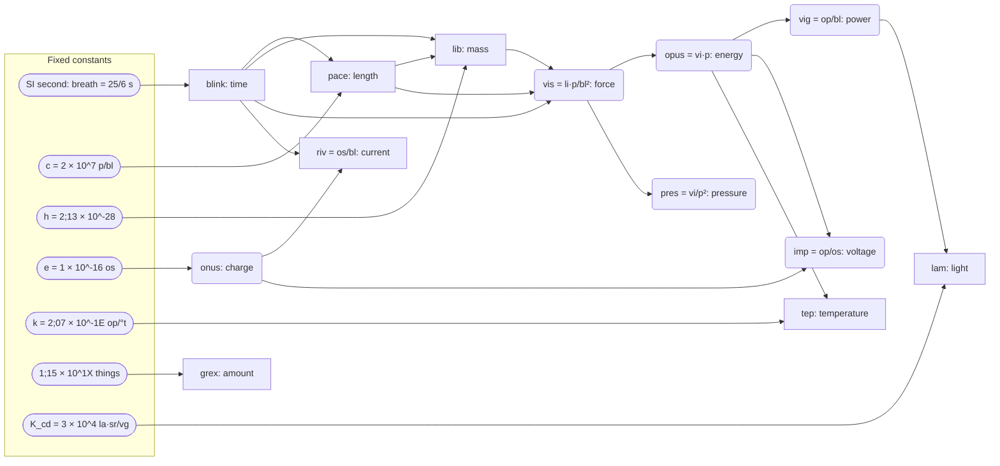
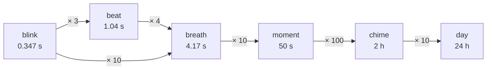
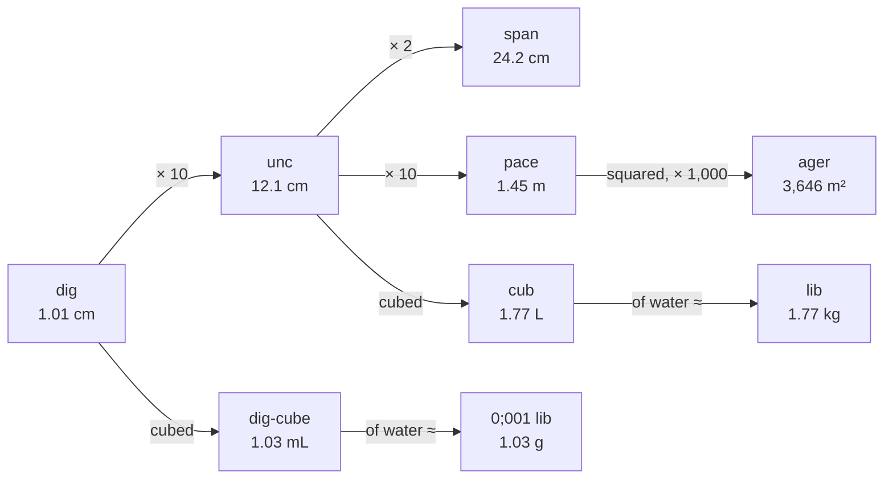
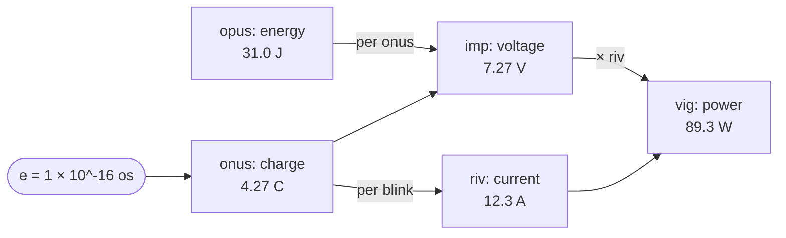

# The Paludal system

Numbers are dozenal unless marked "(dec)".

Paludal is a dozenal (base-12) system of units, built the way SI is built but counted in twelves.
Time comes from a 24-hour day of 86,400 s (dec): the blink is 1/100,000 of a day (twelve to the fifth
power, 25/72 s exactly), and every time unit up to the day is a power of twelve of it. Length comes from
the speed of light, fixed at 2 × 10^7 (20,000,000, or 71,663,616 in decimal) paces per blink, which makes the pace about 1.45 m - close to the
Roman pace. Mass comes from the Planck constant, chosen so that a cub of water (a cube 0;1 pace on each side)
weighs a lib. Temperature, charge, amount and light are each fixed by a constant, as in SI, so every unit
converts exactly to SI. Multiples and fractions step by twelve, which divides evenly by 2, 3, 4 and 6.

**Decided:** the system is called **Paludal** ("paludal units", "is that metric or paludal?").
Fallbacks if needed: **Uncial** (Latin uncia, a twelfth) or **Passic** (from passus, the pace - as metric is from the metre).

**Why:** named after its creator, as Fahrenheit, Celsius and Kelvin are - but hidden: Latin *palus, paludis*
means "a marsh". It matches the Latin naming style of the units, and works as an adjective like "metric".

**Advantage:** a short name that works as an adjective ("paludal units") and fits the Latin unit names, without putting a person's name on show.

**Decided:** **dozenal** is the number system (base twelve) and **Paludal** is the system of units built on
it, as decimal is the number system and metric the units.

**Why:** to keep the two separate. Base ten can be used without metric units, and base twelve without
Paludal ones. Dozenal counting is long established (the Dozenal Society, SDN and the X / E digits all predate
this), and Paludal doesn't claim to have invented it - only the units are new.

**Advantage:** either half can be taught, adopted or argued about on its own - dozenal counting doesn't stand or fall with these units.

Goals: as rigorous as SI (every unit defined by a fixed constant, exact conversion to SI),
but human focused - everyday sizes and rules of thumb matter more than round constants.

**Decided:** the **universal test**: if people and another species had to agree units without access to the
Earth, they could both arrive at Paludal's from physics, chemistry and maths alone. The only Earth-based
inputs allowed are the day and the year (time of day and the calendar), which human life runs on.

**Why:** units that rest only on physics and maths could be shared with anyone - in principle even an alien
species - and rebuilt anywhere, without an Earth measurement or object. Time is the exception because people
live by the day and the year.

**Advantage:** every unit except time can be rebuilt from first principles, and anything that fails the test
is easy to spot (see the table below).

**Decided:** adopt prior art. Where someone has already done something as well or better, use it rather than
invent something new, and credit it (see Prior art).

**Why:** existing work has already been argued over and tested, and some people already use it. Paludal
already adopts SDN, do / gro / mo, dek and el, and the dozenal clock.

**Advantage:** less to invent and less to learn, and Paludal fits in with the dozenal work already out there.

How each part of the system does on the universal test:

| Unit or value | Rests on | Universal test |
|---|---|---|
| blink, beat, breath, moment, chime | the SI second (caesium today, optical clocks later), sized to fit the day | allowed (time); ≈ 8 × 10^11 hydrogen 1S-2S periods for a universal explanation |
| pace | c (physics) and the blink | passes; its size follows from the day |
| lib, cub | h (physics), chosen so a cub of water ≈ 1 lib | passes: water is the same everywhere |
| riv, onus, imp | e (physics) | passes |
| grex | a count, chosen so molar mass ≈ atomic mass | passes |
| turn, prefixes, numbers | maths | passes |
| acidity | pure water | passes |
| tep (size) | k, chosen so freezing to boiling ≈ 100 | mostly: boiling depends on air pressure, which is the Earth's |
| tep (zero, 273.15 K) | water freezing at the Earth's air pressure; 273.15 is an SI number | fails (a pure-physics zero would be absolute zero, ie ta) |
| lam | the human eye's sensitivity, at 540 THz | fails (SI's candela has the same problem) |
| vox (zero) | the threshold of human hearing | fails (human biology) |
| navis | the Earth's meridian | fails (navigation on Earth only) |
| parax | the Earth's orbit (AU) | fails (like the parsec) |
| years, calendar | the Earth's orbit | allowed |

- The failures are all **human conventions on top of the core**: an everyday temperature zero, how bright
  light looks to us, how loud sound is to us, and Earth navigation. None of them is needed to define another
  unit, except that the lam is one of the seven base units

# Part 1: The system

The units themselves: how numbers are written, the defining constants, the base and derived units, prefixes, symbols and names.

## Summary

### Base units and defining constants

| Quantity    | Unit  | Size (SI)              | Defined by (exact)                            | Named after |
|-------------|-------|------------------------|-----------------------------------------------|---|
| Time        | blink | 0.347222 s (25/72 s)   | 1 breath (10 blinks) = 25/6 SI seconds | English: the blink of an eye |
| Length      | pace  | 1.452545 m             | c = 2 × 10^7 paces/blink                      | Latin passus, a pace |
| Mass        | lib   | 1.771431 kg            | h = 2;13 × 10^-28                             | Latin libra, pound / scales |
| Temperature | tep   | 0.694346 K             | k = 2;07 × 10^-1E, 0 tep = 273.15 K (freezing) | Latin tepor, warmth |
| Current     | riv   | 12.2847 A              | e = 1 × 10^-16 onus                           | Latin rivus, stream |
| Amount      | grex  | 6.17235 × 10^23 (dec) things | 1 grex = 1;15 × 10^1X things            | Latin grex, flock |
| Light       | lam   | 0.980246 cd            | K_cd = 3 × 10^4 lam·sr/vg at 19,042,90X,764,540 per blink | Latin lampas, lamp |

### Exact SI values

Every unit converts to SI exactly. The definitions use Paludal's fixed constants, which give short round
numbers; written as SI fractions most of them would be long:

| Unit | Defined by | Exact SI value | Decimal (dec) |
|---|---|---|---|
| blink | 1 breath = 25/6 s | 25/72 s | 0.347 222 222 s |
| pace | c = 2 × 10^7 p/bl | 3,747,405,725 / 2,579,890,176 m | 1.452 544 670 m |
| lib | h = 2;13 × 10^-28 | a fraction of 96 digits | 1.771 431 179 kg |
| tep | k = 2;07 × 10^-1E | a fraction of 36 digits | 0.694 345 838 K |
| onus | e = 1 × 10^-16 | 1.602176634 × 10^-19 × 12^18 C (dec) | 4.265 528 250 C |
| riv | onus per blink | a fraction of 44 digits | 12.284 721 361 A |
| grex | 1;15 × 10^1X things | a fraction of 38 digits | 1.024 943 427 mol |

### Derived and everyday units

| Quantity          | Unit | Size (SI)        | Named after |
|-------------------|------|------------------|---|
| Beat              | beat | 1.04167 s (3 blinks, 25/24 s) | English: a heartbeat |
| Clock unit        | breath | 4.16667 s (10 blinks = 4 beats) | English: one breath |
| Dozenal hour      | chime | 2 hours exactly (1,000 breaths, 0;1 day) | English: clocks chime on the hour |
| Dozenal minute    | moment | 50 s exactly (0;01 chime, 10 breaths) | English moment, from Latin momentum |
| 1/10 pace         | unc  | 12.1 cm          | Latin uncia, a twelfth |
| 1/100 pace        | dig  | 1.01 cm          | Latin digitus, finger |
| 0;2 pace          | span | 24.2 cm          | English span, a hand's spread |
| 0;4 pace          | ulna | 48.4 cm          | Latin ulna, forearm |
| 1,000 paces        | iter | 2.51 km          | Latin iter, road, journey |
| 930 paces (sea, air) | navis | 1.935 km      | Latin navis, ship |
| Area (1,000 p²)   | ager | 3,646 m²         | Latin ager, field |
| Volume (unc³)     | cub  | 1.7736 L         | Latin cubus, cube |
| Force             | vis  | ≈ 21.3 N         | Latin vis, force |
| Energy            | opus | ≈ 31.0 J         | Latin opus, work |
| Power             | vig  | ≈ 89.3 W         | Latin vigor, liveliness |
| Pressure          | pres | ≈ 10.1 Pa        | Latin pressus, pressed |
| Charge            | onus | ≈ 4.266 C        | Latin onus, load |
| Voltage           | imp  | ≈ 7.268 V        | Latin impetus, push |

### How the units connect

Each fixed constant defines one base unit; the derived units are built from the base units.



### Rules of thumb

- A cub of water weighs a lib (0.9994 at 20°C). A dig-cube of water ≈ 1/1,000 lib ≈ 1 g.
- Time of day = chime;moments (d;dd), like hours:minutes: 0;00 midnight, 3;00 dawn, 6;00 noon, 9;00 dusk.
- A moment (50 s) is about a minute; a beat (1.04 s) is about a second.
- 100 km/h ≈ 68 paces/breath; motorway limit 70 (105 km/h).
- Water freezes at 0 tep, boils at ≈ 100 tep. Body ≈ 45;3 tep.
- 240 V mains ≈ 29 imp, 230 V ≈ 27;8, 120 V ≈ 14;6, a 12 V car ≈ 1;8. A kettle draws ≈ 0;X riv.
- A 6 ft person ≈ 1¼ paces. 1 inch ≈ 2;6 digs.

## Symbols

**Decided:** digits 0 1 2 3 4 5 6 7 8 9 X E (X = ten, E = eleven); print alternative ↊ ↋ (U+218A / U+218B).

**Why:** X and E can be typed on any keyboard and work in plain text; ↊ ↋ are the Unicode standard glyphs for
typeset documents. Primel plans the same pair (Pitman's digits) and uses the lookalikes ᘔ Ɛ only until fonts
catch up. Kept after review, even though software reads E as an exponent (a spreadsheet turns
6E62 into 6 × 10^62) and hexadecimal uses E for fourteen. Rejected: lowercase x and e (software reads 6e62
the same way); A and B as in hexadecimal (A = ten, B = eleven) - safe in software, but they lose the link
to the spoken names dek and el.

**Advantage:** dozenal numbers can be written anywhere - keyboard, plain text, handwriting - and still match the spoken dek and el.

- In data files, write ↊ ↋ or store dozenal numbers as text (quoted), so software can't misread them.
  Quoting also protects the semicolon, which some files use to separate fields

### Unit symbols

**Decided:** first two letters of the name, lowercase. Exceptions: pace = **p** (most used, and "pa" would
clash with Pa), vig = **vg** (vi is vis), grex = **gx** (gr = grain). No symbol may clash with an SI or
imperial symbol, since both systems will be in use side by side.

**Why:** one simple rule is easy to learn and guess. Symbols must not clash with SI or imperial ones because both systems will be in use side by side for a long time. Pace gets a single letter because it's used most.

**Advantage:** a symbol can be guessed from its name (and the name from the symbol), and never means something else in SI or imperial.

**Decided:** where the first two letters make a common English word, use the first and last letters instead,
as the moment does (mt): beat = **bt** (not be), iter = **ir** (not it), onus = **os** (not on).

**Why:** a review found that "add 3 it", "2 on of charge" and "1;3 be" read as English. opus keeps **op**:
its first and last letters (os) would be the onus, and "op" isn't a common word on its own.

**Advantage:** no symbol reads as an English word, so a quantity can't be mistaken for text.

| Unit   | Symbol | Quantity |
|--------|--------|----------|
| blink  | bl     | time |
| beat   | bt     | time |
| breath | br     | time |
| moment | mt     | time |
| chime  | ch     | time |
| pace   | p      | length |
| unc    | un     | length |
| dig    | di     | length |
| span   | sp     | length |
| ulna   | ul     | length |
| iter   | ir     | length |
| navis  | na     | length (sea and air) |
| parax  | px     | length (stars) |
| lib    | li     | mass |
| cub    | cu     | volume |
| ager   | ag     | area |
| tep    | °t     | temperature |
| tep absolute | ta | absolute temperature |
| vis    | vi     | force |
| opus   | op     | energy |
| vig    | vg     | power |
| pres   | pr     | pressure |
| riv    | ri     | current |
| onus   | os     | charge |
| imp    | im     | voltage |
| grex   | gx     | amount |
| lam    | la     | light |
| vox    | vo     | sound level |
| turn   | tu     | angle |

- chime: **ch** (the imperial chain is no longer used, so no real clash)
- moment: **mt** (first and last letters: "mo" is the spoken word for 1,000, and mm is the millimetre)

**Decided:** temperature uses **°t** (eg 25°t), for readings and differences alike, like °C. It's written
with no space between the number and the degree sign: 25°t, not 25 °t (and 25°C, 77°F when those appear). Plain-ASCII
fallback: **te**. A bare "25°" is fine where tep is the expected scale (eg weather).

**Why:** the degree sign means "a scale with a chosen zero", which is what the tep is (0 = freezing, like
Celsius), and people already read 25°C / °F that way. Lowercase because tep isn't named after a person
(°C and °F are), and it avoids T (tesla). It's still two characters, so it fits the spirit of the rule.
Written without a space because the sign belongs to the number, the way 5ml is usually written on labels.

**Advantage:** readings look like the °C and °F people already know, can't be confused with the tesla, and
a temperature reads as one unit (25°t) that can't be split across a line.

- Examples: 1;3 p tall, 2;6 li, 25°t, 68 p/br, 29 im

**Decided:** all unit and prefix symbols are lowercase (tqop, not tqOP or TQop).

**Why:** every prefix ends in q or c, so the boundary between prefix and unit is already clear. Capitals
would clash with chemical elements (Cu, Be, Br, La), and all-capital units read as acronyms. Reusing SI
prefix letters for powers of twelve (k = ×1,000;) was rejected: the same letter meaning a 1.728× different
factor would cause errors where both systems are in use.

**Advantage:** there's nothing to remember about case, and no symbol can be mistaken for a chemical element or an SI prefix.

### Prefix symbols

**Decided:** initials of the SDN digit roots, then **q** (multiply) or **c** (divide). The last letter is always
q or c, so a symbol can always be read unambiguously.

**Why:** built from the SDN roots we already use, so there's no separate table to memorise. Ending in q or c keeps them unambiguous even though some roots share initials (quad / qua).

**Advantage:** nothing new to learn, and any prefix symbol can be read back without a table.

**Decided:** in typeset text (print, web pages, PDFs) the q and c are shown as Primel's arrows: **↑** for
multiply and **↓** for divide, so `tqop` is set as t↑op and `tcli` as t↓li. Plain text keeps q and c.

**Why:** adopt prior art: Primel already writes the same prefixes with the same letters and arrows, so
Paludal and Primel documents look alike. q and c stay for plain text, where arrows can't always be typed.

**Advantage:** the direction of a prefix shows at a glance, Primel readers can read Paludal symbols as they
stand, and the plain-text form still works on any keyboard.

| Digit  | 0 | 1 | 2 | 3 | 4 | 5 | 6 | 7 | 8 | 9 | X | E |
|--------|---|---|---|---|---|---|---|---|---|---|---|---|
| Root   | nil | un | bi | tri | quad | pent | hex | sept | oct | enn | dek | el |
| Letter | n | u | b | t | q | p | h | s | o | e | d | l |

- uq ×10, bq ×100, tq ×1,000, unq ×10^10; uc ÷10, bc ÷100, tc ÷1,000
  (typeset: u↑ ×10, b↑ ×100, t↑ ×1,000, un↑ ×10^10; u↓ ÷10, b↓ ÷100, t↓ ÷1,000)
- Prefix goes straight onto the unit symbol: 3 tqp = 3 triqua-paces, 5 bcli = 5 bicia-libs
- The named sizes keep their own symbols: unc = un (= ucp), dig = di (= bcp)
- el's letter is **l** ("el" is how L is said); e is taken by enn
- Watch: enn's "e" (9) is easily confused with the digit E (el); bq looks like Bq (becquerel)

### Spoken numbers

**Decided:** digits X = **dek**, E = **el** (the DSA standard names). Powers use **do / gro / mo**:

**Why:** dek and el are the established standard names, so we use them (and changed the prefix roots to match, not the other way round). Calling 10; "ten" would be heard as decimal. do / gro / mo are short, and bimo / trimo extend them the way million / billion extend thousand.

**Advantage:** dozenal numbers can be said aloud without being heard as decimal, and large ones scale the way thousand and million do.

| Number | Name  | (dec)    |
|--------|-------|----------|
| 10     | do    | 12       |
| 100    | gro   | 144      |
| 1,000   | mo    | 1,728     |
| 10^6   | bimo  | 2,985,984  |
| 10^9   | trimo | 5.16 × 10^9 |

- Digits are grouped in threes, like thousand / million: 4,000,000 = four bimo
- 46 = "four do six", 2X3 = "two gro dek do three", 6,E62 = "six mo el gro six do two"
- Never say "ten" for 10; - it gets heard as decimal
- Codes, phone numbers etc. are read digit by digit; after the semicolon, always digit by digit
  (3;18 = "three dit one eight")

**Decided:** the dozenal point (the semicolon) is said **"dit"**: π ≈ 3;18 = "three dit one eight", 0;6 = "zero dit
six". The decimal point stays "point" (or "dot"). Times of day are said without it, like clock times today
(E;91 = "el, nine-one").

**Why:** adopt prior art: "dit" is the established way to say the semicolon used as a dozenal point (the
"Humphrey point"), and SDN uses it, in contrast to "dot" for a decimal point.

**Advantage:** a spoken number carries its base, the way the written semicolon does, so "three dit one eight"
can't be heard as 3.18.

## Writing numbers

**Decided:** decimal uses a dot (eg 3.14); dozenal uses a semicolon (3;18481).

**Why:** the punctuation shows which base a number is in, so the two can't be confused.

**Advantage:** the base of any number can be seen at a glance, even with no unit or marker.

**Decided:** long numbers are grouped in threes with commas, in both bases: 100,000 (dozenal), 86,400 (dec).
Four-digit numbers are grouped too (1,728). Not grouped: years (2026 CE, 6859 DH), dates, times of day
(E;X053), and digits after the point.

**Why:** groups of three are the easiest for people to read, and they match how numbers are spoken
(thousand / million, mo / bimo). The comma is free in both bases, since decimal uses a dot as the point and
dozenal a semicolon. It replaces SI's thin space (86 400), which is easy to miss, gets lost when text is
copied, and can split a number across two lines. Where the comma is the decimal point (much of Europe),
86,400 could be misread; the dot-and-semicolon rule above already settles which mark is the point.

**Advantage:** long numbers are easy to read, copy and say, in either base.

- eg 0;4 is 4/10; (a third), or 0.333... (dec)

Halves, thirds, quarters and sixths all end after one digit. The catch: a quarter is 0;3 and a third is
0;4, the opposite of what the digits suggest. Fifths and tenths recur, as thirds do in decimal.

| Fraction        | Dozenal      | Decimal   |
|-----------------|--------------|-----------|
| 1/2             | 0;6          | 0.5       |
| 1/3             | 0;4          | 0.333...  |
| 2/3             | 0;8          | 0.666...  |
| 1/4             | 0;3          | 0.25      |
| 3/4             | 0;9          | 0.75      |
| 1/6             | 0;2          | 0.1666... |
| 1/8             | 0;16         | 0.125     |
| 3/8             | 0;46         | 0.375     |
| 1/9             | 0;14         | 0.111...  |
| 1/12 (dec)      | 0;1          | 0.0833... |
| 1/16 (dec)      | 0;09         | 0.0625    |
| 1/5             | 0;2497 2497... | 0.2     |
| 1/10 (dec)      | 0;1 2497 2497... | 0.1   |
| 1/7             | 0;186X35 186X35... | 0.142857... |

**Decided:** the dozenal percent is **per gro** (per 144 dec), written **/gro**: 75% = 0;9 = 90 /gro; 65% ≈ 0;7X = 7X /gro.

**Why:** it parallels "per cent" (Latin centum is the number word, as gro is ours). The two digits after
the semicolon are already the per-gro figure, so nothing needs converting. "Per bicia" was rejected: bicia
already means ÷100;, so "per bicia" would mean ×100;. % can't be reused - it would be read as decimal. No
established dozenal symbol is known, so /gro is used for now.

**Advantage:** a per-gro figure is read straight off a fraction, with no arithmetic.

**Decided:** fractions (numbers below one) always have a leading zero: 0;6, never ;6.

**Why:** a bare leading semicolon is easy to miss or mistake for punctuation, and it keeps a semicolon
at the start of a number from ever being ambiguous.

**Advantage:** a fraction can never lose its point in print or handwriting.

**Decided:** how to tell dozenal and decimal numbers apart, when both are in use:

1. A number with a unit needs no marker: the unit says which system (46 p is dozenal, 54 m is decimal).
2. A number containing X or E is dozenal.
3. Each document states its default base (this one: dozenal).
4. A bare number in mixed text is marked: dozenal with a trailing semicolon (**46;**), decimal with
   **(dec)**, or a subscript ᵈ in typeset documents. Small numbers that read the same in both (0-9)
   and number words (twelve) need no marker.
5. Years: CE years are decimal (2026 CE), DH years are dozenal (6859 DH).
6. Colour can be added on screen, but never as the only signal.

**Why:** most real numbers carry a unit, so they're already unambiguous; markers are only needed for bare
numbers. The trailing semicolon is just the dozenal point with nothing after it (like "46." in decimal),
so it works in plain text and handwriting without any new symbol. Colour fails in print, handwriting,
plain text and for colour-blind readers. Numeric subscripts (46₁₂) were rejected: "12" is itself
ambiguous - in dozenal it means fourteen. Years get their era instead of a marker because
the era is already written with years (CE / DH), so it costs nothing extra.

**Advantage:** mixed text stays unambiguous with almost no extra marks, in any medium and for any reader.

## Prefixes

**Decided:** use SDN (Systematic Dozenal Nomenclature, Dozenal Society of America).

**Why:** it's an existing standard, it's systematic (prefixes are built from digit names, not memorised), and it extends to any power. Roots for X and E were changed to dek / el to match the spoken digits.

**Advantage:** a prefix for any power can be built on the spot, and the system is already documented and in use.

Digit roots: 0 nil, 1 un, 2 bi, 3 tri, 4 quad, 5 pent, 6 hex, 7 sept, 8 oct, 9 enn, X dek, E el
(SDN's own roots for X and E are dec and lev; changed to match the spoken digit names)

- multiply by 10^n: root(s) + **-qua**  (unqua- ×10, biqua- ×100, triqua- ×1,000, ... unnilqua- ×10^10)
- divide by 10^n:   root(s) + **-cia**  (uncia- ÷10, bicia- ÷100, tricia- ÷1,000, ...)
- uncia = Latin "a twelfth" (origin of inch and ounce)
- Common sizes also get short everyday names (unc = uncia-pace, dig = bicia-pace)
- Prefix symbols: see Symbols

### Prefix matrix

Each unit in the middle, with its fractions to the left and multiples to the right, one step of twelve at a
time. Sizes that have their own name are in bold; use the name rather than the prefix form (a dig, not a bcp).

| tricia- ÷1,000 | bicia- ÷100 | uncia- ÷10 | **Unit** | unqua- ×10 | biqua- ×100 | triqua- ×1,000 |
|---|---|---|---|---|---|---|
| tcbl<br>201 µs | bcbl<br>2.41 ms | ucbl<br>28.9 ms | **blink** bl<br>0.347 s | **breath** br<br>4.17 s | **moment** mt<br>50 s | tqbl<br>10 min |
| tcp (lin, proposed)<br>0.841 mm | **dig** di<br>1.01 cm | **unc** un<br>12.1 cm | **pace** p<br>1.45 m | uqp<br>17.4 m | bqp<br>209 m | **iter** ir<br>2.51 km |
| tcli<br>1.03 g | bcli<br>12.3 g | ucli<br>148 g | **lib** li<br>1.77 kg | uqli<br>21.3 kg | bqli<br>255 kg | tqli<br>3.06 t |
| tcte<br>402 µK | bcte<br>4.82 mK | ucte<br>57.9 mK | **tep** °t<br>0.694 K | uqte<br>8.33 K | bqte<br>100 K | tqte<br>1.2 kK |
| tcri<br>7.11 mA | bcri<br>85.3 mA | ucri<br>1.02 A | **riv** ri<br>12.3 A | uqri<br>147 A | bqri<br>1.77 kA | tqri<br>21.2 kA |
| tcgx<br>593 µmol | bcgx<br>7.12 mmol | ucgx<br>85.4 mmol | **grex** gx<br>1.02 mol | uqgx<br>12.3 mol | bqgx<br>148 mol | tqgx<br>1.77 kmol |
| tcla<br>567 µcd | bcla<br>6.81 mcd | ucla<br>81.7 mcd | **lam** la<br>0.980 cd | uqla<br>11.8 cd | bqla<br>141 cd | tqla<br>1.69 kcd |
| tccu<br>1.03 mL | bccu<br>12.3 mL | uccu<br>148 mL | **cub** cu<br>1.77 L | uqcu<br>21.3 L | bqcu<br>255 L | tqcu<br>3.06 m³ |
| tcvi<br>12.4 mN | bcvi<br>148 mN | ucvi<br>1.78 N | **vis** vi<br>21.3 N | uqvi<br>256 N | bqvi<br>3.07 kN | tqvi<br>36.9 kN |
| tcop<br>17.9 mJ | bcop<br>215 mJ | ucop<br>2.58 J | **opus** op<br>31 J | uqop<br>372 J | bqop<br>4.46 kJ | tqop<br>53.6 kJ |
| tcvg<br>51.7 mW | bcvg<br>620 mW | ucvg<br>7.44 W | **vig** vg<br>89.3 W | uqvg<br>1.07 kW | bqvg<br>12.9 kW | tqvg<br>154 kW |
| tcpr<br>5.85 mPa | bcpr<br>70.2 mPa | ucpr<br>843 mPa | **pres** pr<br>10.1 Pa | uqpr<br>121 Pa | bqpr<br>1.46 kPa | tqpr<br>17.5 kPa |
| tcos<br>2.47 mC | bcos<br>29.6 mC | ucos<br>355 mC | **onus** os<br>4.27 C | uqos<br>51.2 C | bqos<br>614 C | tqos<br>7.37 kC |
| tcim<br>4.21 mV | bcim<br>50.5 mV | ucim<br>606 mV | **imp** im<br>7.27 V | uqim<br>87.2 V | bqim<br>1.05 kV | tqim<br>12.6 kV |

- Named sizes that aren't a single prefix step: **beat** = 3 bl; **chime** = 10,000 bl (qqbl, 2 h); the day =
  100,000 bl (pqbl); **span** = 0;2 p; **ulna** = 0;4 p; **navis** = 930 p; **parax** (star distances);
  **ager** = 1,000 p² (tqp² would be read as (tqp)², so it gets a name)
- Prefixed temperatures use the plain-text symbol te (tcte), as °C is rarely prefixed; they're for science only
- tqbl is 0;1 chime (10 minutes), which needs no name, as "ten minutes" doesn't

## Names

**Decided:** short names (3-4 letters preferred), Latin roots where possible, no clash with an existing unit,
no everyday word whose meaning would mislead, and no object or container names.

**Why:** short names are quick to say and write; Latin roots echo older measures (pace, uncia, libra) and work
across languages; clashes cause confusion when both systems are in use. Everyday words are fine when their
meaning fits the size (pace, span, dig, blink, beat, breath, moment, chime) - that's what makes them easy to
remember. The rule used to say "no clash with existing everyday words", which contradicted those names.

**Advantage:** units are quick to say, easy to remember, and never confused with SI or imperial ones.

| Quantity               | Name  | Symbol | Size (SI)           | Named after                                       | English relatives            |
|------------------------|-------|--------|---------------------|---------------------------------------------------|------------------------------|
| Time (base)            | blink | bl     | 0.3472 s            | English: the blink of an eye                      |                              |
| Time (≈ second)        | beat  | bt     | 1.0417 s            | English: a heartbeat                              |                              |
| Time (clock)           | breath | br    | 4.1667 s            | English: one breath                               |                              |
| Time (dozenal hour)    | chime | ch     | 2 h exactly         | English: clocks chime on the hour                 |                              |
| Time (dozenal minute)  | moment | mt    | 50 s exactly        | Latin momentum, movement; medieval moment = 90 s  | moment, momentum             |
| Length (base)          | pace  | p      | 1.4525 m            | Latin passus, a pace (Roman pace ≈ 1.48 m)        | pace, passage                |
| 1/10 pace              | unc   | un     | ≈ 12.1 cm           | Latin uncia, a twelfth                            | inch, ounce                  |
| 1/100 pace             | dig   | di     | ≈ 1.01 cm           | Latin digitus, finger (Roman digit ≈ 1.85 cm)     | digit                        |
| 0;2 pace               | span  | sp     | ≈ 24.2 cm           | English span, a hand's spread                     | span                         |
| 0;4 pace               | ulna  | ul     | ≈ 48.4 cm           | Latin ulna, forearm (elbow to fingertip)          | ell                          |
| 1,000 paces (distance)  | iter  | ir     | ≈ 2.51 km           | Latin iter, road, journey                         | itinerary                    |
| 930 paces (sea, air)   | navis | na     | ≈ 1.935 km          | Latin navis, ship                                 | navy, navigate               |
| Star distances         | parax | px     | 2.30 pc, 7.5 ly     | parallaxis, astronomers' Latin (from Greek)       | parallax                     |
| Area                   | ager  | ag     | ≈ 3,646 m²          | Latin ager, field                                 | agriculture                  |
| Mass                   | lib   | li     | ≈ 1.7714 kg         | Latin libra, pound; also scales (Roman pound)     | lb (pound), Libra            |
| Volume (unc cube)      | cub   | cu     | 1.7736 L            | Latin cubus, cube                                 | cube, cubic                  |
| Temperature            | tep   | °t     | 0.694 K/°C          | Latin tepor, warmth                               | tepid                        |
| Force                  | vis   | vi     | ≈ 21.3 N            | Latin vis, force, strength                        | vim                          |
| Energy                 | opus  | op     | ≈ 31.0 J            | Latin opus, work                                  | opus, operate                |
| Power                  | vig   | vg     | ≈ 89.3 W            | Latin vigor, liveliness, energy                   | vigour, vigorous             |
| Pressure               | pres  | pr     | ≈ 10.1 Pa           | Latin pressus, pressed                            | press, pressure              |
| Current                | riv   | ri     | ≈ 12.28 A           | Latin rivus, a stream                             | rivulet, derive              |
| Charge                 | onus  | os     | ≈ 4.266 C           | Latin onus, load, burden                          | onus, onerous                |
| Voltage                | imp   | im     | ≈ 7.268 V           | Latin impetus, push, rush                         | impetus, impetuous           |
| Amount of substance    | grex  | gx     | 6.17 × 10^23 things | Latin grex, flock, herd                           | gregarious, congregate       |
| Luminous intensity     | lam   | la     | 0.980 cd            | Latin lampas, lamp, torch                         | lamp                         |
| Sound level            | vox   | vo     | ≈ 0.90 dB per vox   | Latin vox, voice                                  | voice, vocal                 |

- Rejected: heft, jug (object names), pond (sounds like a lake), mass/vol (clash with quantity names / "% vol"),
  hand (clashes with horse hand 10.16 cm), nail, inc (too close to "inch"), lux/lum (existing SI units),
  cal (calorie), pot (container), erg (CGS unit), grad (gradian), mol (mole)

## Time

**Decided:** base unit **the blink** = 1/10 breath ≈ 0.34722 seconds (1/100,000 of a day)

**Decided:** **beat** = 3 blinks = 0;3 breath = 25/24 s ≈ 1.04 s - the nearest thing to a second.
Clock unit: the **breath** = 10 blinks = 4 beats = 1/10,000 of a day (1/20,736 dec) ≈ 4.16667 seconds.

**Why:** the time units are named after the body's own rhythms - a blink of the eye, a heartbeat, a breath -
which suits a human-focused system and makes a memorable set (blink, beat, breath). The sizes fit: a blink
lasts ~0.1-0.4 s, a resting heart beats ~once a second, and a resting breath (or one "in for 4" count in
meditation) is ~4 s. The beat was added because people need a second-sized unit (counting, timing, music).
Rejected: tick for 0.35 s (a clock tick is ~1 s); tick / tock (clock words don't pair with breath); pulse.
The old 4.17 s "tick" is now the breath. Clocks can still "tick" each beat informally. Removed: the wink (half a blink, 0.17 s) - too fast to be
useful at human scale.

**Advantage:** time units are easy to remember and to feel: beats and breaths can be counted without a clock.

**Why:** with the breath as base, derived units are tiny (force 0.148 N, power 0.052 W).
With the blink: force ≈ 21.3 N, energy ≈ 31 J, power ≈ 89 W, pressure ≈ 10.1 Pa - human-sized.

**Advantage:** force, energy, power and pressure come out at everyday sizes (vis ≈ 21 N, vig ≈ 89 W), usable without prefixes.

Steps are dozenal (× 10 = ×12 dec, × 100 = ×144 dec):



- Blink is the base for physics; beat and breath are the everyday units (like the second and minute in SI).
- Human scale: reaction time ≈ 3/4 blink, heartbeat 2-3 blinks, 100 m sprint ≈ 28 (dec) blinks

- days divided into 10,000 breaths (twelve to the 4th power = 20,736 dec)
  - 0;1    day = 2 hours (1 chime)
  - 0;01   day = 10 minutes
  - 0;001  day = 50 seconds (1 moment)
  - 0;0001 day = 1 breath ≈ 4.1667 seconds

**Decided:** the **chime** = 0;1 day = 1,000 breaths = 2 hours exactly, the dozenal hour (clocks chime on the
hour). Rejected: bell (sounds like the bel, B; ship's bells are half-hours), hora, mark.

**Why:** people use hours constantly, so the dozenal system needs an hour-sized unit; 0;1 day is the 2-hour mark on the twelve-mark dial. "Chime" is what clocks do on the hour.

**Advantage:** an hour-sized unit that is also a clean step of the day: one chime is one mark on the dial.

**Decided:** the **moment** (symbol **mt**) = 0;01 chime = 10 breaths = 50 s exactly - the dozenal minute.

**Why:** time of day works like hours, minutes and seconds: three named parts. The chime is the hour, the
moment the minute (two digits, read by the long hand against fine marks), the breath the second. The
10-minute digit (0;1 chime) needs no name, just as "ten minutes" doesn't. "Wait a moment" already means about
a minute, and the medieval moment was a unit of time (90 s).

**Advantage:** the clock reads like hours, minutes and seconds, with a word people already use for about a minute.

**Decided:** time of day is written **d;dd** (chime; moments) or **d;ddd** with breaths - like 21:45 and 21:45:30.

**Why:** people handle 3-digit groups more easily than 4, the first digit matches the clock dial, and the
groups match the clock's three hands.

**Advantage:** times are short to write, and read straight off the clock's hands.

| Time   | Chime | Moments | Breath | Reads                          |
|--------|-------|---------|--------|--------------------------------|
| E;917  | E     | 91      | 7      | el chimes, 91 moments, 7 breaths |
| 6;00   | 6     | 00      |        | noon                           |

- 0;00 = midnight, 6;00 = noon
- the number is in chimes: the time 9;3X0 is the fraction 0;93X day
- durations use the same form: +1;30

**Decided:** times more precise than a breath just add digits, with no separator: E;X053 (3 blinks past
E;X05). On screens, the extra digits are shown smaller or dimmer, like the hundredths on a stopwatch.

**Why:** a time of day is a single number - chimes since midnight - so times can be subtracted and compared
directly (E;X05 - 9;300 = 2;705 chimes ≈ 5 h 10 min). A second semicolon (E;X05;3) would break that, and a space
(E;X05 3) makes the digits look unrelated. Decimal times do the same: 9.58 s, 1:23.45 on a stopwatch.

**Advantage:** any two times can be subtracted or compared as ordinary numbers, at any precision.

- spoken like "nine forty-five": E;91 = "el, nine-one"; 6;00 = "six"; with breaths, "el, nine-one, seven"

### Definition of time

**Decided:** **1 breath = 25/6 SI seconds exactly** (1 blink = 25/72 s). Today that is 7,50E,583,273 caesium
periods (38,302,632,375 dec), since SI fixes the caesium frequency.

**Why:** time is the one unit that has to fit the Earth, and SI already keeps the second for the whole world.
Defining the breath by the SI second rather than by the caesium count means the two can never split: when SI
redefines the second with optical clocks (planned for 2030 CE), caesium becomes a measured value, and a
caesium-count definition would drift from SI by about 1 part in 10^16 (dec). Replaces the earlier
definition by the caesium count (which Primel also uses). Every other base unit stays defined by a fixed
constant (c, h, k, e, the grex count), because those are fixed in SI too, so they can't drift either, and their
values are short round dozenal numbers where the same units written as SI fractions would be up to 96 digits
long (see Exact SI values).

**Advantage:** Paludal time never drifts from UTC or SI, needs no leap breaths of its own, converts to SI
exactly, and gets every future improvement to the second for free.

- So 1 blink = 750,E58,327;3 caesium periods today (terminates in dozenal; 3,191,886,031.25 dec)
- The day stays at exactly 86,400 SI seconds.
- Converting between SI and dozenal time is exact (no drift, no leap breaths beyond what SI already needs).
- Leap breaths: none of our own. The breath follows UTC, and leap seconds are being phased out
  (CGPM 2022 CE: UTC will be allowed to drift further from the Earth's rotation by 2035 CE), so whatever UTC
  does, Paludal time does too.
- Survives the planned SI redefinition of the second (optical clocks, ~2030 CE): the breath simply follows the SI second.
  SI fixes the caesium-133 frequency at exactly 9,192,631,770 Hz (since 1967 CE); that count, like ours, was
  chosen to fit the Earth (the 1900 CE year). The planned replacement will probably be a weighted mix of
  several optical clock transitions rather than one atom, about 100 times more precise. Because the breath is
  exactly 25/6 SI seconds, Paludal gets whatever SI chooses at no cost
- **A universal approximation:** 1 blink ≈ **8 × 10^11 periods of the hydrogen 1S-2S transition** (0.038%
  dec out). Hydrogen is the simplest atom and the most common element, and its frequencies can in
  principle be calculated from fundamental constants, so it's the natural way to explain the blink to someone
  with no Earth reference (the Pioneer plaque used hydrogen for the same reason)
- Not used as the definition: the 1S-2S frequency is measured to 4.5 × 10^-15 (dec), about 45 times less
  precisely than caesium fountain clocks, and the two best measurements differ by 17 Hz; defining time by it
  would lose the exact SI conversion. A round count (8 × 10^11) would also put clocks 33 s a day off the day
- Not based on the day itself (Earth's rotation is irregular) - must be as good as SI.
- Rejected:
  - 7,500,000,000 (fully round): day 77 s too short, drifts ~8 h/year.
  - 7,50E,580,000: drifts ~4.6 s (~1.1 breaths)/year, needs a leap breath nearly every year.
  - 7,50E,583,000: drifts ~0.31 s/year - acceptable, but no real benefit over exact.
  - 7,50E,583,270: would make the blink a whole number of periods (750,E58,327), but the breath would no
    longer be exactly 25/6 s, so Paludal clocks would drift ~2.5 ms/year from UTC (1 s in ~400 years)
    and every time conversion would need a long factor.

## Length

**Decided:** the **pace** ≈ 1.4525 m, defined by **c = 2 × 10^7 paces per blink** (exact).

**Why:** a round speed of light gives an exact, SI-quality definition. The size is human: close to the
Roman pace (Latin passus, ~1.48 m), and 1,000 paces ≈ a Roman mile.

**Advantage:** length is exact in SI terms and still a comfortable body size.

Other round values of c were checked. Fewer paces per blink means a longer pace, so:

| c (paces/blink) | pace   | unc     | dig    | cub (≈ lib of water) | vis (force) | opus (energy) |
|-----------------|--------|---------|--------|----------------------|-------------|---------------|
| 1 × 10^7        | 2.91 m | 24.2 cm | 2.0 cm | 14.2 L               | 342 N       | 993 J         |
| **2 × 10^7**    | 1.45 m | 12.1 cm | 1.0 cm | 1.77 L               | 21.3 N      | 31.0 J        |
| 4 × 10^7        | 73 cm  | 6.1 cm  | 5 mm   | 0.22 L               | 1.3 N       | 1.0 J         |

Rejected: both alternatives - the values go too whacky. 1 × 10^7 makes everything bigger (a 2.9 m pace and a
14 kg lib are too large for everyday use); 4 × 10^7 makes the unc (6 cm) and cub (0.22 L) small, though
its opus is almost exactly a joule.

Named sub-units (named because they're everyday sizes, like the inch and centimetre):

- **unc** = 1/10 pace (1/12 dec) ≈ 12.1 cm
- **dig** = 1/100 pace (1/144 dec) ≈ 1.01 cm

**Decided:** the **span** (symbol **sp**) = 0;2 pace = 2 uncs ≈ 24.2 cm, a hand's spread.

**Why:** a body-measure name like pace and dig, for the gap between the unc (12 cm) and the pace (145 cm);
the old English span (9 in, 22.9 cm) is close. "Hand" was rejected earlier (the horse hand is 10.16 cm).

**Advantage:** a familiar body length for the 20-30 cm range, with no clash.

**Decided:** the **ulna** (symbol **ul**) = 0;4 pace = 4 uncs ≈ 48.4 cm, elbow to fingertip (a third of a pace).

**Why:** another body measure, filling the gap between the span (24 cm) and the pace (145 cm); it's also a
handy length for a board ruler. Latin *ulna* is the forearm (and the forearm bone), and the old ell measure
came from it. Rejected: cubit (Latin cubitum, elbow), which was liked, but its symbol would be "cu", the cub.

**Advantage:** fills the 30-90 cm gap with a body measure, and suits a board ruler.

**Decided:** the **iter** (symbol **ir**) = 1,000 paces (1,728 dec) ≈ 2.51 km, the unit for distances.

**Why:** a thousand paces is the Roman mile (mille passus), so it's the natural distance unit. Latin
*iter* means a road or journey (as in itinerary), and Roman route lists counted in milia passuum.
Rejected: mille / mil (mi is the mile, mil is the thou), via (vi is the vis). League and stade were also
considered; their clashes hardly matter since almost no one uses them now, but iter was preferred.

**Advantage:** a round distance unit with a long history, whose name means "journey".

**Decided:** iter is pronounced **"EYE-ter"**, as in itinerary.

**Why:** a fixed pronunciation stops it being heard several ways ("IT-er", as in Latin, or "EE-ter"),
and it's the sound people already know from itinerary.

**Advantage:** everyone says it the same way, using a sound they already know.

- Defined by the speed of light: **c = 2 × 10^7 paces per blink** (exact)
  - = 2 × 10^8 paces per breath = 859,963,392 (dec) per breath
  - (equivalently 2 × 10^10 paces per day)
- Light travels 2 × 10^8 paces in one breath ≈ 1,249,135 km (dec), about 3.25× the Earth-Moon distance
- 1 iter = 1,000 paces = 2.51 km is literally a "thousand paces" (Latin mille passus = Roman mile)
- 15 iters ≈ 42.67 km ≈ a marathon (marathon = 14;99 iters)

**Decided:** the **navis** (symbol **na**) = 930 paces (1,332 dec) ≈ 1.935 km, the sea and air mile, replacing
the nautical mile (1,852 m).

**Why:** the nautical mile exists because one nautical mile north or south is one minute of latitude
(1/21,600 (dec) of a turn), so a navigator can measure distance off a chart's latitude scale. The dozenal
version is 0;0001 turn of the Earth's meridian (1/20,736 (dec), four digits of a turn):

**Advantage:** navigators can still read distances straight off a chart's latitude scale.

- Meridian (pole to pole and back) = 40,007.86 km (dec)
- 0;0001 turn = 40,007,860 m / 20,736 = 1,929.4 m = 1,328.3 (dec) paces = **928;34 paces**
- A minute of latitude isn't constant (1,843 m at the equator, 1,862 m at the poles, as the Earth is flattened),
  so the nautical mile was fixed at a round 1,852 m in 1929 CE. The navis is rounded the same way
- 928 paces is the nearest whole number (0.03% short); **930** was chosen as rounder (ends in 0) and it's
  only 0.3% long, well inside the ±0.5% that a minute of latitude itself varies
- So 1 navis ≈ 0;0001 turn of latitude, and 10,000 navis ≈ once round the Earth through the poles
- Name: Latin *navis*, a ship (as in navy, navigate). Symbol "na" follows the first-two-letters rule
- Still open: a speed unit for ships and aircraft, to replace the knot (1 nautical mile per hour)

Imperial comparisons:

| Imperial | Paces  | Uncs  | Digs  |
|----------|--------|-------|-------|
| 6 ft     | 1;314  | 13;14 | 131;4 |
| 1 ft     | 0;263  | 2;63  | 26;3  |
| 6 in     | 0;131  | 1;31  | 13;1  |
| 1 in     | 0;026  | 0;26  | 2;6   |

### Gravity

- Would like g to be a nice dozenal number, but c and g have a fixed ratio (~2,559,X65 breaths), so only one can be exact.
- With c exact: g ≈ 0;9926 paces/blink² (≈ 99;26 paces/breath², 117.2 dec)
- g varies ~0.5% over Earth's surface anyway, so it's a poor basis for a definition.

### Star distances

**Decided:** the **parax** (symbol **px**), a dozenal parsec: the distance at which the Earth's orbit (1 AU, the Earth-Sun distance)
spans **0;000001 turn** (1/2,985,984 dec of a turn, 0.434 arcseconds).

**Why:** star distances come out as handy numbers - the nearest star is just under 1 (0;694), the centre of
the Milky Way about 2,000 - and the distance is simply 1 over the parallax in millionths of a turn.
0;00001 turn was rejected because it makes star distances too large.

**Advantage:** star distances are small, handy numbers, read straight from the measured parallax.

The parsec is the same idea in degrees: the distance at which 1 AU spans 1 arcsecond (1/3,600 of a degree),
so a star's distance follows straight from its parallax, the yearly shift in its position seen from either
side of the Earth's orbit. That, not its size, is why astronomers use it: research papers give distances in
parsecs (kpc, Mpc), star brightness is compared at a standard 10 parsecs (absolute magnitude), and the
light-year is mostly for the public. The parsec is exact in SI (648,000/π AU), and this would be too:

- 1 parax = 1,000,000 / 2π AU = 1X,E02;14 AU (475,234 dec) = 3;2155 × 10^13 p
- = 2.304 parsecs = 7.515 light-years (dec)
- Parallax in millionths of a turn gives the distance directly: a star that shifts 0;000004 turn is 0;3 px away
- 0;00001 turn (5.2 arcseconds) would give 0.192 parsecs

| Object | Parsecs (dec) | Parax |
|---|---|---|
| Proxima Centauri (nearest star) | 1.30 | 0;694 |
| Sirius | 2.64 | 1;19 |
| Pleiades | 136 | 4E |
| Centre of the Milky Way | 8,180 | 2,079 |
| Andromeda galaxy | 765,000 | 140,193 |

**Decided:** the name **parax**, symbol **px**.

**Why:** it's named after parallax, the way the parsec (parallax-second) is, so astronomers will recognise
it. The root is Greek, but *parallaxis* was the word astronomers used when they wrote in Latin (Tycho Brahe,
Kepler); classical Latin had no word for it, and the medieval *diversitas aspectus* ("difference of view")
is too long to shorten well. Five letters, but the link to parallax is worth more than the rule. Symbol: "pa" is the pascal, so first and last letters; px is also the screen pixel, which isn't
an SI or imperial unit. Rejected: sidus (Latin, a star; "si" reads as SI), caelum (Latin, the sky; too long).

**Advantage:** astronomers recognise it at once, and the name says how the distance is measured.

## Mass

**Decided:** the **lib** ≈ 1.7714 kg, defined by fixing Planck's constant:
**h = 2;13 × 10^-28 exactly** (lib × pace² / blink) - same method SI has used since 2019 CE.
(= 2;13 × 10^-27 in lib × pace² / breath - same unit, just expressed per breath)

**Why:** fixing a constant is how SI defines mass since 2019 CE, so conversion is exact. The value of h was chosen so a cub of water ≈ 1 lib - the everyday rule of thumb matters more than a round constant.

**Advantage:** mass converts exactly to SI, and a cub of water still weighs about a lib.

- The value of h was chosen so a cube of water 1 unc per side (1 cub) ≈ 1 lib
  - water at 20°C: 0.9994 (better than SI's 1 L of water = 0.9982 kg at 20°C)
- Everyday rule of thumb works at every scale (1,728 (dec) = 1,000;):
  - 1 cub of water (12.1 cm side) ≈ 1 lib (1.77 kg)
  - 1 dig-cube of water (1.01 cm side) ≈ 1/1,000 lib (≈ 1.03 g)
- 0;1 lib ≈ 147.6 g, 0;01 lib ≈ 12.3 g, 0;001 lib ≈ 1.025 g
- Converts exactly to kg (h is exact in SI too)
- Rejected:
  - Water itself as the definition: density depends on temperature, pressure, isotopes (SI dropped it for this reason)
  - 10^20 carbon-12 atoms (1.584 kg; 12^24 dec): nicely dozenal, but the dalton is not exact in SI
  - h = 2 × 10^-28 (1.864 kg): rounder h, but water cube only 0.95
- Priority used: c round > water ≈ 1 > h round. Normal people use c-based length and water; almost nobody uses h directly.

## Area

**Decided:** the **ager** (symbol **ag**) = 1,000 square paces (1,728 dec), eg a strip 100 × 10 paces
≈ 3,646 m² (dec) = 0.90 acre. Everyday land sizes are fractions of it.

**Why:** land needs a unit between the square pace and the square iter, and this one lands close to the acre
with nearly the same strip shape (the acre is a furlong × a chain, 10:1; this is 12:1). Name: Latin *ager*,
field (as in agriculture). The symbol "ag" also reads as silver (Ag), but land sizes and silver rarely
appear in the same sentence.

**Advantage:** a land unit close to the acre people already picture, in a round number of square paces.

| Ager  | m² (dec) | Close to |
|-------|----------|----------|
| 0;3   | 911      | quarter-acre house block (1,012 m²) |
| 0;6   | 1,823     | half acre |
| 1     | 3,646     | acre (4,047 m²) |
| 10    | 43,750   | a 100 × 100 pace square, 4.4 ha |

## Volume

**Decided:** the **cub** = a cube 1 unc per side ≈ 1.7736 L. Water in it ≈ 1 lib.

**Why:** volume follows directly from length (no separate definition), it makes the water rule of thumb
work, and dozenal fractions of it land close to common drink sizes.

**Advantage:** volume needs no definition of its own, a cub of water weighs about a lib, and drink sizes stay familiar.

How length leads to area, volume and (through water) mass:



Good size for milk. Dozenal fractions land close to common drink and pub sizes (all ~4% larger):

| Fraction   | mL   | Close to                                                |
|------------|------|---------------------------------------------------------|
| 1          | 1,774 | large milk                                              |
| 0;8 (2/3)  | 1,182 | pub jug (AU 1,140)                                       |
| 0;6 (1/2)  | 887  |                                                         |
| 0;4 (1/3)  | 591  | pint (AU 570, UK 568); US 20 fl oz bottle (591) - almost exact |
| 0;3 (1/4)  | 443  | schooner (AU 425); 440 mL can                           |
| 0;2 (1/6)  | 296  | pot/middy (AU 285), UK half pint (284); 300 mL bottle   |
| 0;1 (a twelfth) | 148  | small glass / wine pour (150)                           |

Small volumes (kitchen and drinks):

| Fraction | mL   | Close to                                                            |
|----------|------|---------------------------------------------------------------------|
| 0;06     | 73.9 | quarter cup                                                         |
| 0;1      | 148  | half cup                                                            |
| 0;2      | 296  | cup (AU 250, US 237) - a bit larger                                 |
| 0;025    | 29.8 | spirit shot (30 mL)                                                 |
| 0;01     | 12.3 | standard drink of pure alcohol: 9.7 g ethanol (AU std drink = 10 g) |
| 0;004    | 4.1  | teaspoon (5 mL)                                                     |
| 0;001    | 1.03 | a dig-cube, about 1 mL / 1 g of water                               |

### Rainfall

**Proposed (not decided):** rainfall is measured as a depth in **lin** (0;1 dig ≈ 0.84 mm; the name is
also still proposed), and that's the same number as libs of water per square pace.

- A cub is 0;001 cubic pace, so 1 cub spread over 1 square pace is 0;001 p = 1 lin deep, and a cub of water
  weighs about a lib. So **1 lin of rain = 1 li of water per p²** - just as 1 mm of rain is 1 L (1 kg) per m²
- Gauges keep measuring depth, as they do now; the lib figure is for tanks, roofs and gardens:
  10 lin of rain on a 100 p² roof (304 m²) is 1,000 li, which fills 1,000 cu (1 tqcu, 3.06 m³) of tank

| Rain | mm (dec) | lin |
|---|---|---|
| Light shower | 1 | 1;2 |
| Rainy day | 10 | E;X |
| Heavy storm | 25 | 25;8 |
| Flood rain | 100 | 9X;E |
| Sydney, a year | 1,200 | 9XE |

## Temperature

**Decided:** the **tep**, defined by fixing the Boltzmann constant **k = 2;07 × 10^-1E** (opus/tep), exact.

**Why:** 0 tep = freezing is what people actually need for weather and cooking (like Celsius). The size splits the gap between freezing and boiling into 100; equal steps (144 dec), so water
freezes at 0°t and boils at 100°t - the dozenal version of Celsius's 0 and 100.

**Advantage:** freezing is 0 and boiling 100, so weather and cooking temperatures read like Celsius.

- 1 tep = 0.694346 K (within 0.014% of 0;01 of the freezing-boiling gap)
- **0 tep = freezing** (273.15 K, same anchor as Celsius) - human focused; kelvin-style zero rejected
- Triple point of water (273.16 K = 0.01°C) ≈ **0;021°t**, not 0. Anchoring 0°t at 273.15 K exactly, like
  Celsius, keeps 0°t = 0°C; the triple point has been a measured value (not exact) since SI's 2019 redefinition,
  so anchoring there would gain nothing
- boiling (sea level) ≈ EE;E9 tep, effectively 100 (144 dec). (SI's Celsius isn't exact either: 99.974°C)
- 1 tep ≈ 0.694°C ≈ 1.25°F
- body temperature ≈ 45;35 tep, room temperature (21°C) ≈ 26 tep
- absolute zero ≈ -289;48 tep (no nice ratio between absolute zero, freezing and boiling - fine)

**Decided:** absolute temperature (from absolute zero, for gas laws and physics) is written **ta**, spoken
"tep absolute": 0 ta = absolute zero, freezing = 289;485 ta, so ta = °t + 289;485. Everyday temperatures stay
°t (or te), from freezing.

**Why:** most people will only ever use the everyday scale, so it keeps the plain names; the absolute scale
just needs to be distinguishable, as K is from °C. "a" for absolute follows psia / psig (pounds per square
inch absolute / gauge). Rejected: "tabs" and "tea" (English words).

**Advantage:** everyday temperatures keep the simple name, and physics still gets an absolute scale that can't be mistaken for it.

## Electricity

**Decided:** fix the elementary charge **e = 1 × 10^-16 onus** exactly (12^-18 dec).

**Why:** a round fixed constant, exactly like SI. imp × riv is always a vig (89.3 W), so e only decides how
that is split between voltage and current. This split puts the imp at 7.27 V and the riv at 12.3 A, where
the everyday numbers fall best: the voltages printed on batteries, chargers, cars and sockets need no
prefix (car 1;8 im, mains 28 or 29 im), and household currents are about a riv (a kettle 0;X riv, a
16 A circuit 1;4 riv). Replaces
the earlier e = 1 × 10^-15 (riv 1.02 A, imp 87.2 V), which made currents neat but left every everyday
voltage needing a prefix (AA 2;6 bcim, car 1;8 ucim).

**Advantage:** the numbers people actually read - voltages on labels and sockets, currents on chargers and circuits - mostly need no prefix.



- 1 onus (charge) ≈ 4.266 C
- 1 riv (current, onus/blink) ≈ 12.285 A - about what a socket circuit carries (10-16 A)
- 1 imp (voltage, opus/onus) ≈ 7.268 V
- Common voltages aren't round (set by chemistry and history), but they're all plain imps. Small ones use
  the uncia-imp (ucim, 0;1 imp ≈ 0.606 V), and small currents the tricia-riv (tcri ≈ 7.1 mA):

| Voltage          | imp    | uncia-imp |
|------------------|--------|-----------|
| 1.5 V (AA)       | 0;258  | 2;58      |
| 5 V (USB)        | 0;830  | 8;30      |
| 12 V (car)       | 1;799  | 17;99     |
| 24 V             | 3;376  | 33;76     |
| 120 V mains      | 14;62  |           |
| 230 V mains      | 27;79  |           |
| 240 V mains      | 29;03  |           |

| Current                    | riv   |
|----------------------------|-------|
| 20 mA (LED)                | 0;003 (2;9X tcri) |
| 2 A (phone charger)        | 0;1E5 |
| 10 A (AU socket, kettle)   | 0;992 (≈ 0;X) |
| 16 A (EU socket circuit)   | 1;376 |
| 20 A (US circuit)          | 1;765 |
| 32 A (oven, EV charger)    | 2;731 |

- Rejected: e = 1 × 10^-15 (riv 1.02 A, imp 87.2 V: every everyday voltage needs a prefix);
  1 × 10^-17 (imp 0.61 V, riv 147 A: voltages are whole numbers, but a phone charger is 0;017 riv);
  0;2 × 10^-15 (imp 14.5 V, riv 6.1 A: a car battery is about 1 imp, but mains and sockets come out no better).
- No choice makes both close to SI: imp × riv = vig (89.3 W), fixed by the mechanical units, where
  volt × amp = 1 W. The split can only trade one for the other.

## Amount of substance

**Decided:** the **grex** = exactly **1;15 × 10^1X** entities (≈ 6.17235 × 10^23 dec).

**Why:** molar masses then come out ≈ atomic masses in 1/1,000 lib, the same convenience chemists have with g/mol.

**Advantage:** chemists' rule of thumb (molar mass ≈ atomic mass) carries over unchanged.

- Chosen so molar masses ≈ atomic masses in 1/1,000 lib (like SI's g/mol): carbon-12 = 11.998, water = 18.01 (dec)
- Rejected: exactly 10^1X (5.52 × 10^23 dec) - rounder, but molar masses come out ×0.894;
  SI's Avogadro number - molar masses off by 2.5%

## Light

**Decided:** the **lam** is defined by fixing the luminous efficacy of green light at
**K_cd = 3 × 10^4 lam·sr/vg** (exact), for light of frequency **19,042,90X,764,540 per blink** (exact; 540 THz).
That makes 1 lam ≈ 0.980246 cd.

**Why:** every other base unit is defined by a constant stated in Paludal units; the lam used to be the SI
candela carried over, so it couldn't be defined without SI. A round K_cd per vig is the Paludal equivalent of
SI's 683 lm/W. Replaces the earlier decision to keep lam = 1 cd ("rarely used, nothing to gain").

**Advantage:** every base unit is now defined within Paludal, and still converts exactly to SI.

- The frequency is SI's 540 THz exactly, expressed per blink. It isn't round (≈ 1;9043 × 10^11), for the same
  reason the caesium count isn't: a round frequency (eg 1;9 × 10^11 per blink, 556 nm instead of 555 nm) would
  mean converting to the candela through the eye's sensitivity curve, so the conversion would no longer be exact
- 683 lm/W expressed per vig is 2E,357;1E (60,979 dec). 3 × 10^4 (62,208 dec) is the nearest one-digit round
  number; 2E,000 would be closer (lam = 1.008 cd) but isn't as round
- Lamp ratings change by 2%: an 800 lumen bulb is about 580 paludal lumens (lam·sr; 816 dec)

## Angle

**Decided:** angles are measured in **turns**, written as dozenal fractions.

**Why:** it matches the clock: the chime hand turns once a day, so the time of day in days *is* the angle of
the hand (0;1 turn = one chime on the dial). The common angles become round: right angle 0;3, 30° is 0;1,
60° is 0;2, 45° is 0;16. Degrees written in dozenal digits work (360° = 260°) but stay awkward
(90° = 76°, 45° = 39°), because 360 is a decimal-era choice.

**Advantage:** common angles are single digits, and a clock hand's angle is the time of day.

**Decided:** the turn's symbol is **tu** (eg a right angle is 0;3 tu).

**Why:** it follows the first-two-letters rule. "t" alone was considered, but it's the tonne's symbol, and no
symbol may clash with an SI one.

**Advantage:** it follows the symbol rule and doesn't clash with the tonne.

| Turn   | Degrees (dec) | Note |
|--------|---------------|------|
| 1      | 360           | full turn |
| 0;6    | 180           | half turn |
| 0;3    | 90            | right angle |
| 0;2    | 60            | |
| 0;16   | 45            | |
| 0;1    | 30            | one clock mark |
| 0;01   | 2.5           | |
| 0;001  | 0.208         | finest everyday step |

- Compass bearings as three digits of a turn: 000 north, 300 east, 600 south, 900 west
- Latitude and longitude in turns: one navis (930 p) along a meridian is about 0;0001 turn of latitude
- Three digits act as "more degrees": 1,000; steps per turn (1,728 dec, 0.208° each), and every common angle
  is a round whole number: right angle 300, 60° 200, 45° 160, 30° 100. A right angle of 1,000; adds nothing
  over this, since 4 already divides 100;.
- 1 turn = 2π radians = 6;34941697 radians

## Constants

Physical constants in Paludal units (3-4 significant dozenal digits unless exact). "Exact" means fixed by
definition; measured values carry the same uncertainty as in SI.

### Defining constants (exact)

| Constant | Paludal value | SI value (dec) |
|---|---|---|
| Breath (defines time) | 25/6 SI seconds; today = 7,50E,583,273 caesium periods | 9,192,631,770 Hz caesium |
| Speed of light c | 2 × 10^7 p/bl (2 × 10^8 p/br) | 299,792,458 m/s |
| Planck constant h | 2;13 × 10^-28 li·p²/bl | 6.62607015 × 10^-34 J s |
| Elementary charge e | 1 × 10^-16 os | 1.602176634 × 10^-19 C |
| Boltzmann constant k | 2;07 × 10^-1E op/tep | 1.380649 × 10^-23 J/K |
| Grex number | 1;15 × 10^1X per grex | 6.17235 × 10^23 (Avogadro: 6.022 × 10^23) |
| Luminous efficacy K_cd | 3 × 10^4 lam·sr/vg, for light at 19,042,90X,764,540 per blink | 683 lm/W, at 540 THz |

### Derived from them (also exact)

| Constant | Paludal value | SI value (dec) |
|---|---|---|
| Reduced Planck ħ = h/2π | 4;028 × 10^-29 li·p²/bl | 1.054572 × 10^-34 J s |
| Gas constant R = k × grex number | 0;2359E op/(tep·gx) | 8.314 J/(mol K) |
| Faraday constant F = e × grex number | **1;15 × 10^4 os/gx** | 96,485 C/mol |
| Stefan-Boltzmann σ | 1;735 × 10^-9 vg/(p²·tep⁴) | 5.670 × 10^-8 W/(m² K⁴) |

### Measured

| Constant | Paludal value | SI value (dec) |
|---|---|---|
| Gravitational constant G | 3;558 × 10^-E p³/(li·bl²) | 6.674 × 10^-11 m³/(kg s²) |
| Electron mass | X;21 × 10^-25 li | 9.109 × 10^-31 kg |
| Proton mass | X;986 × 10^-22 li | 1.673 × 10^-27 kg |
| Fine-structure constant α (no units) | 1 / E5;0523 | 1 / 137.036 |

### Earth and everyday

| Value | Paludal | SI (dec) |
|---|---|---|
| Standard gravity g (conventional, exact) | 0;9926 p/bl² (99;26 p/br²) | 9.80665 m/s² |
| Standard atmosphere | 5;969 tqpr | 101,325 Pa |
| Absolute zero | -289;485°t | -273.15°C |
| Water freezes / boils (sea level) | 0°t / ≈ EE;E9°t | 0°C / 99.974°C |
| Water density | 1;002 li/cu at 4°C, 0;EEE at 20°C | 999.97 / 998.2 kg/m³ |
| Speed of sound (20°C) | ≈ 6X p/bl | 343 m/s |
| Day | 10^5 bl = 10^4 br (exact) | 86,400 s |
| Tropical year | 265;2XX days | 365.2422 days |
| Earth radius (mean) | 1,576 ir | 6,371 km |
| Earth-Moon distance | 7;476 × 10^4 ir | 384,400 km |
| Astronomical unit (Earth-Sun, exact) | 1;7E63 × 10^X p = 1;7E63 × 10^7 ir | 149,597,870,700 m |
| Light from the Sun to Earth | 9E;9 br ≈ X moments | 499.0 s (8 min 19 s) |
| Light from the Moon to Earth | 3;84 bl ≈ 1;3 bt | 1.282 s |
| Light-year | 5;0X6 × 10^12 p | 9.461 × 10^15 m |

### Pure numbers (the same in any base, dozenal digits)

| Number | Dozenal | Decimal |
|---|---|---|
| π | 3;184809493E92 | 3.14159265358979 |
| 2π (radians in a turn) | 6;34941697 | 6.28318531 |
| e | 2;875236069822 | 2.71828182846 |
| √2 (paper ratio) | 1;4E79170X07E8 | 1.41421356237 |
| φ (golden ratio) | 1;74EE6772802X | 1.61803398875 |

- The Faraday constant comes out round because both e and the grex number are round
- g isn't round: c is, and only one of them can be (see Gravity)

# Part 2: Using it

How the units meet everyday life: clocks and calendars, changeover, money, standard sizes, everyday values and conversions.

## A day in Paludal

**Draft (not decided):** a walk through one ordinary day, for someone seeing the system for the first time.
Times are chime;moments (6;00 is noon). Values are rounded the way a label or sign would be.

| Time | What happens | Paludal | Today |
|---|---|---|---|
| 3;30 | The alarm goes off. The forecast says 18° now, top of 28° | 18°t, 28°t | 6:30 am, 14°C, 22°C |
| 3;76 | A regular coffee and two eggs | 250 tccu (357 mL), 50 tcli each | 7:15 am, 12 oz coffee (355 mL), 60 g eggs |
| 4;20 | Drive to work: 4;9 iters, about 26 moments door to door, 40 on the signs | 4;9 ir, 26 mt, 40 p/br | 8:20 am, 12 km, 25 min, 60 km/h |
| 6;30 | Lunch break | 30 mt (0;3 ch) | 12:30 pm, 30 min |
| 6;60 | Back to work | | 1:00 pm |
| 8;76 | Fill up on the way home: 1X;7 cubs at $3;56 a cub. The family car uses 14;4 cu/100 ir, so the drive to work took 0;66 cu, about $1;X6 | 1X;7 cu for $66, 0;66 cu for $1;X6 | 5:15 pm, 40 L at $1.95/L = $78; 1 L, $1.87, at 8 L/100 km |
| 8;90 | An after-work run: 2 iters in 30 moments | 2 ir, 30 mt | 5:30 pm, 5 km in 30 min |
| 9;46 | Shopping: mince, milk and flour | 0;3 li, 1;2 cu, 0;7 li | 6:45 pm, 450 g, 2 L, 1 kg |
| 9;46 | A roast goes in for 0;9 chime | 1X0°t for 0;9 ch (90 mt) | 180°C for 1½ hours |
| E;30 | Bed, for 4 chimes of sleep | 4 ch | 10:30 pm, 8 hours |

- Prices use the proposed dozenal dollar: $1 stays $1, split into 100; (144 dec) parts, so $3;56 is $3.46
  (see Money)
- The clock reads like a 24-hour clock halved: 3;30 is a quarter past the third chime (6:30 am)
- Every step is twelve, so the common fractions are single digits: 30 moments is 0;3 chime (a quarter),
  0;6 is a half, 0;4 a third

## Clocks, time zones and calendar

The time units themselves are in Part 1 (Time).

### Analogue clocks

**Decided:** a 24-hour dial with twelve marks, noon at the top, turning clockwise.

**Why:** one turn per day shows the whole day at a glance; noon at the top matches the sun at its highest,
and clockwise keeps the convention people already know.
The design, and the idea of splitting the day by twelve, then twelve, then twelve as the basis of Paludal time,
came from Paul Rapoport's Diurnal clock (https://clocks.dozenal.ca).

**Advantage:** the whole day is visible at once, and the hand follows the sun.

Four hands - hour, minute and second, plus a light beat hand:

| Hand    | Turns once per | Reads         | Dial                                   | Like        |
|---------|----------------|---------------|----------------------------------------|-------------|
| Chime   | day            | chime (0-E)   | 12 marks                               | hour hand   |
| Moment  | chime (2 h)    | moments 00-EE | 12 marks + 144 (dec) fine marks        | minute hand |
| Breath  | moment (50 s)  | breath (0-E)  | 12 marks; steps once per breath (onto each mark) | second hand |
| Beat    | moment (50 s)  | beat (4 per breath) | steps once per beat; thin and light grey, like the dial | ticking second hand |

- The breath hand steps once per breath, landing on each mark, so it always points at the breath digit.
  It used to step once per beat (4 steps per mark), but then it looked like a beat hand while labelled breath
- **Noon (6;00) points straight up, midnight (0;00) straight down**
  - dawn ≈ 3;00 on the left, dusk ≈ 9;00 on the right (at the equinoxes)
  - **Clockwise everywhere** (bottom → left → top → right), both hemispheres - matches convention,
    and clocks are clockwise because they copied northern sundials
  - matches the sun's path when facing south in the northern hemisphere, so a correctly
    oriented clock roughly agrees with a sundial
- Compared with the clocks at https://clocks.dozenal.ca (Paul Rapoport; reviewed 2026 CE): their "Diurnal 1"
  is the same design - one turn a day, 0 (midnight) at the bottom, 6 (noon) at the top, each hand twelve
  times faster than the next. They also offer a **semidiurnal** clock (the slow hand turns twice a day, like
  am / pm, with dozenal hands below it), and "signed" versions that count down to the next mark after
  half way (as "twenty to eight" does). Their readout is the same number as ours: noon is 600

### Daylight saving and time zones

**Decided:** no daylight saving, for now.

**Why:** a 1-hour shift is half a chime (0;6), which changes the moment digits (6;45 becomes 6;X5).
Shifting a whole chime (2 h) is too big a jump. Neither is good, and places half a chime apart (eg NSW and
Queensland in summer) are annoying to deal with. Dropping it puts NSW and Queensland on the same time all year.

**Advantage:** the clock never jumps, and neighbouring places stay on the same time all year.

**Decided (for now):** keep today's 24 time zones, based on UTC (London is +0). Neighbouring zones are half a
chime (1 hour) apart, so offsets are whole or half chimes; a few places keep their quarter-hour offsets.
To review later.

**Why:** twelve whole-chime zones would probably be too few.

**Advantage:** today's zones and offsets carry over unchanged.

Standard time (no daylight saving):

| City | UTC now (standard time) | Paludal (chimes) | Local time when London is 6;00 (noon) |
|---|---|---|---|
| Honolulu | UTC-10 | UTC-5;00 | 1;00 |
| Anchorage | UTC-9 | UTC-4;60 | 1;60 |
| Los Angeles, Vancouver | UTC-8 | UTC-4;00 | 2;00 |
| Denver | UTC-7 | UTC-3;60 | 2;60 |
| Chicago, Mexico City | UTC-6 | UTC-3;00 | 3;00 |
| New York, Toronto | UTC-5 | UTC-2;60 | 3;60 |
| Santiago | UTC-4 | UTC-2;00 | 4;00 |
| São Paulo, Buenos Aires | UTC-3 | UTC-1;60 | 4;60 |
| London, Reykjavik | UTC | UTC | 6;00 |
| Paris, Berlin, Rome | UTC+1 | UTC+0;60 | 6;60 |
| Cairo, Johannesburg | UTC+2 | UTC+1;00 | 7;00 |
| Moscow, Istanbul | UTC+3 | UTC+1;60 | 7;60 |
| Dubai | UTC+4 | UTC+2;00 | 8;00 |
| Karachi | UTC+5 | UTC+2;60 | 8;60 |
| Delhi, Mumbai | UTC+5:30 | UTC+2;90 | 8;90 |
| Kathmandu | UTC+5:45 | UTC+2;X6 | 8;X6 |
| Dhaka | UTC+6 | UTC+3;00 | 9;00 |
| Bangkok, Jakarta | UTC+7 | UTC+3;60 | 9;60 |
| Beijing, Singapore, Perth | UTC+8 | UTC+4;00 | X;00 |
| Tokyo, Seoul | UTC+9 | UTC+4;60 | X;60 |
| Adelaide, Darwin | UTC+9:30 | UTC+4;90 | X;90 |
| Sydney, Melbourne, Brisbane | UTC+10 | UTC+5;00 | E;00 |
| Auckland | UTC+12 | UTC+6;00 | 0;00 (next day) |

### Years

**Decided:** years are counted in the **Dozenal Holocene** (DH) era of the Dozenal Holocene calendar: year 0
began in 9565 BCE, so for dates from 1 January on, **DH year = CE year + 9563 (dec)**. 2026 CE = **6859 DH**.
The year still starts on 1 January.

**Why:** a dozenal system shouldn't start its count at 10,000 BCE: that's only a round number in decimal
(5,954 in dozenal). Adopt prior art instead: the Dozenal Holocene calendar (Paul Rapoport and Sanketh Kolhar)
already counts years in dozenal from the start of the Holocene, and its start has an astronomical reason -
around 9564 BCE the Earth was last nearest the Sun on the northern summer solstice. Replaces the earlier
Human (Holocene) Era (Emiliani's, 1 HE = 10,000 BCE, which made 2026 CE 6E62 HE). "DH" rather than "HE",
because HE already means Emiliani's count.

**Advantage:** the year count shares an origin with existing dozenal calendars, has a reason other than a
decimal round number, and keeps every year of recorded history positive.

- 2026 CE = 11,589 (dec) = **6859 DH**. A BCE year n is 9564 - n (dec) DH
- New Year stays on 1 January (the Gregorian months are kept, see Calendar). The Dozenal Holocene calendar
  itself starts its year at the December solstice (about 21 December UTC), so between the solstice and
  31 December its year number is already one higher. If that calendar is ever adopted, New Year moves with it
- Spoken as two pairs, like "twenty twenty-six" (that's how years are said now): 6859 = "six do eight, five do
  nine"
  - round years: 7000 = "seven mo", 6900 = "six do nine gro"

### Calendar

**Decided:** keep the standard Gregorian months and 7-day weeks. Only the numbering changes:
**week numbers** (ISO weeks) are written in dozenal: week 1 to 44 (52 dec), 45 in long years (53 dec).

**Why:** 365 (dec) days can't be split into dozenal-round months, and changing the 7-day week is too big a change. Writing the numbers in dozenal keeps the whole system consistent.

**Advantage:** dates and weeks stay as people know them; only the digits change.

- eg 3 Oct 2026 CE is week 34 (ISO week 40 dec)

**Decided:** keep the month names January to December (Jan to Dec). In all-number dates the month is its
dozenal number: October is X, November E, December 10 (eg 6859-X-03).

**Why:** the names were briefly replaced by the SDN digit roots (Un, Bi, Tri ... Sept, Oct, Enn, Dek, El, Do),
which fixed the Roman misnumbering (September to December were the seventh to tenth months when the year began
in March). But Sept and Oct already mean September and October, so "3 Oct" became ambiguous - a permanent
confusion, worse than the old misnumbering. Rejected: SDN roots (that clash); Greek roots (mono, di, tri,
tetra ... octa, ennea, deca), which shorten to Oct and Dec and clash the same way; a -men suffix (Latin
mensis), which reads as English "men" (Hexmen, Septmen).

**Advantage:** no month name can be mistaken for another, and dates read as they do today.

**Day of month (decided):** written in dozenal, 1 to 27 (31 dec).

**Why:** every number in the system is dozenal; a date shouldn't mix bases.

**Advantage:** a date is written in one base, like every other number.

- eg 3 Oct 2026 CE = 3 Oct 6859; 31 (dec) Oct = 27 Oct; Christmas = 21 Dec

**Possibility (not decided):** the Dozenal Holocene calendar (Paul Rapoport, with Sanketh Kolhar;
https://clocks.dozenal.ca/pdf/dozenal-calendar.pdf): twelve months of 30 (dec) days, each of five 6-day weeks
("stretches"), with the 5-6 leftover "S-days" outside any month but spread through the year so the months
keep in step with the seasons. The year starts on a solstice or equinox (the December solstice by default)
instead of 1 January, so leap years follow the Sun rather than a divide-by-4 rule. Months are numbered (or
named after the zodiac in Greek), and the six days are named after colours (Ruber, Arantius, Flāvus, Viridis,
Cæruleus, Purpureus).
- A 6-day week would mean a 4-day working week with the usual 2-day weekend
- For now, the 7-day week stays: changing it is too big a change, and 365 (dec) days can't be split evenly anyway

## Speed limits and changeover

- 100 km/h ≈ 67;82 paces/breath. Same digits at every scale because units step by twelve
  (≈ 6,782;14 paces per 0;01 day, ≈ 67,821;49 paces per 0;1 day)
- Speed signs in paces/breath; each 10 = 15.06 km/h (dec):

| Sign | km/h  | mph  | Use           |
|------|-------|------|---------------|
| 20   | 30.1  | 18.7 | school zone   |
| 30   | 45.2  | 28.1 | residential   |
| 40   | 60.2  | 37.4 | urban         |
| 50   | 75.3  | 46.8 | rural         |
| 60   | 90.4  | 56.1 | highway       |
| 70   | 105.4 | 65.5 | motorway      |
| 80   | 120.5 | 74.9 | fast motorway |

- Real limits needn't be round: like any changeover, existing values would be set to the nearest
  whole number rather than converted exactly. The nearest whole numbers land within 0.5 km/h:

| km/h now | Sign | km/h  |
|----------|------|-------|
| 40       | 28   | 40.2  |
| 50       | 34   | 50.2  |
| 60       | 40   | 60.2  |
| 70       | 48   | 70.3  |
| 80       | 54   | 80.3  |
| 90       | 60   | 90.4  |
| 100      | 68   | 100.4 |
| 110      | 74   | 110.4 |

**Decided:** real-world values (limits, products, standards) get rounded new values, not exact conversions.

**Why:** that's how every changeover works in practice (eg metric speed limits), and a whole number is easier to read.

**Advantage:** values are easy to read and remember, as after metrication.

Some fields would keep their current units for a long time, as they did through metrication, because the units
are set by international agreement or built into long-lived equipment:

- Aviation: feet for altitude, knots and nautical miles (set by ICAO, the UN aviation body)
- Shipping: nautical miles and knots
- Medicine: blood pressure in mmHg, and drug doses in mg. Nobody is made to switch: medicine can keep mg for
  as long as it likes, which avoids dose errors
- Inch sizes: screens, wheels and tyre rims, pipe threads
- Traditional sport distances: the marathon and cricket pitch (see Races and sport)

## Money

**Proposed (not decided):** keep each currency's main unit (eg the dollar) at its current value, and divide it
into 100; (144 dec) parts instead of 100 (dec) cents. One part ≈ 0.69 c.

- No currency needs revaluing: $1 stays $1, and only the small change is new
- Halves, thirds, quarters, sixths, eighths and ninths of a dollar are whole numbers of parts:
  a third is $0;40, a quarter $0;30, an eighth $0;16
- Fifths and tenths aren't (20 c = $0;2497...), so prices would be set to round dozenal values, as with any
  changeover (see Speed limits and changeover)
- The cent is from Latin *centum* (100). Name for the 1/100; part: to be decided

## Phone numbers and keypads

**Decided:** phone numbers stay as they are, and phone keypads get a dozenal layout (below).

**Why:** phone numbers are names, not amounts, so dozenal gains them nothing; keypads still need X and E for
amounts, and the 4 × 3 keypad has exactly twelve keys for the twelve digits. * and # can't be reused as
digits because phone systems use them as menu keys.

**Advantage:** no number changes, and the keypad gains the two digits without losing * and # or changing
where 1-9 and 0 are.

- Phone numbers are names, not amounts: nobody adds or divides them, so they gain nothing from dozenal, and
  changing every number in the world would cost a great deal. They're read digit by digit as now (see Spoken
  numbers), like postcodes, PINs and account numbers
- Keypads still need X and E for typing dozenal amounts (prices, times, quantities). * and # can't stand in
  for them: they're already used as menu and control keys by phone systems
- The standard keypad already has twelve keys in a 4 × 3 grid, so a dozenal keypad puts exactly the twelve
  digits there, and moves * and # to a row of their own:

```
 1   2   3
 4   5   6
 7   8   9
 X   0   E
 *       #
```

- 0 stays in the middle of the bottom row, where it is on phones today; X and E take the corners * and # used
  to have, in order (ten before eleven)

**Decided:** the number pad on keyboards and calculators keeps its shape and its 7-8-9-on-top order, and makes
room for X, E and the dozenal point (layout below).

**Why:** the bottom row matches the phone keypad (X 0 E), the footprint stays the same so existing keyboards
and cases still fit, and 7-8-9 stays on top so people keep the muscle memory they have.

**Advantage:** every digit and the point get a key of their own without a bigger pad, and the same X 0 E row
appears on phones, calculators and keyboards.

```
 Num   /    *    -
  7    8    9    +
  4    5    6    ;
  1    2    3   Ent
  X    0    E   Ent
```

- Today's wide 0 is split into X and 0, and the decimal point's key becomes E, so the bottom row reads X 0 E as
  on the phone keypad
- The tall + is split in two, + above and ; (the dozenal point) below; Enter stays tall
- Same footprint and key spacing as today (19 keys instead of 17), so existing cases and keyboards fit
- 7-8-9 stays on top, as on every calculator: changing it would break the muscle memory people already have,
  even though phones count the other way

**Decided:** main keyboards need no new keys.

**Why:** X and E are typed as capital letters (the reason they were chosen; see Symbols), and the semicolon is
already on the home row, unshifted on most layouts. ↊ ↋ only need an input method, not new keys.

**Advantage:** dozenal can be typed on every keyboard in use today.

- X and E are typed as capital letters (see Symbols), and ; is already on the home row, unshifted on most
  layouts - one reason the semicolon makes a good dozenal point
- For typeset ↊ ↋, a keyboard layout option types them with AltGr / Option + X and E; until then, text
  replacement (eg "dek" → ↊) or the Unicode codes (U+218A, U+218B)

## Paper sizes

**Decided:** a **P series**, made the same way as the A series: each size halves the one before, sides in
the ratio 1 : √2, and **P0 = 1 square pace** (as A0 = 1 m²).

**Why:** halving keeps the shape, which is why the A series works; only the starting size needs changing.
P5 lands almost exactly between A4 and US Letter (its width is Letter's 8.5 in), so one sheet can replace both.

**Advantage:** one sheet replaces both A4 and Letter, and every size keeps the same shape.

| Size | mm (dec)      | Close to            |
|------|---------------|---------------------|
| P0   | 1,221 × 1,727   | A0 (841 × 1,189), 2.11 m² |
| P3   | 432 × 611     | A2 (420 × 594)      |
| P4   | 305 × 432     | A3 (297 × 420)      |
| P5   | 215.9 × 305   | A4 (210 × 297), Letter (215.9 × 279) |
| P6   | 153 × 216     | A5 (148 × 210)      |
| P7   | 108 × 153     | A6 postcard (105 × 148) |

- Sides aren't round in uncs (P5 = 1;95 × 2;63 un), for the same reason A4 isn't round in mm: √2

## Shoe sizes

Proposed (not decided): **shoe size = foot length in digs**, in half-dig steps (0;6 di ≈ 5 mm).

Today's systems: UK and US sizes count barleycorns (1/3 in, 8.5 mm) from different starting points, with
separate men's, women's and children's scales; EU sizes count Paris points (2/3 cm) of the shoe's last, not
the foot. Japan and China already use foot length in cm, and the ISO Mondopoint (ski boots, military)
uses foot length in mm. A dig is about a centimetre, so digs work the way Japanese sizes do, with
half-dig steps close to their 5 mm steps.

| Foot length | Digs (nearest half) | US (approx.) | UK (approx.) | EU (approx.) |
|-------------|---------------------|--------------|--------------|--------------|
| 16 cm       | 14 di               | kids' 9      | kids' 8      | 26           |
| 24 cm       | 20 di               | women's 7    | 5            | 38           |
| 25 cm       | 21 di               | women's 8½, men's 7 | 6     | 39-40        |
| 26 cm       | 22 di               | men's 8      | 7            | 41           |
| 27 cm       | 23 di               | men's 9      | 8            | 42-43        |
| 28 cm       | 24 di               | men's 10     | 9            | 44           |

- Sizes vary between brands; the US/UK/EU columns are rough
- Width could be added the Mondopoint way, as a second number

## Everyday reference

What things come to in the new units (3 significant digits). **Round** is what a product, limit or setting
would probably become: small values go to the nearest whole number, half, third or quarter (within 3%);
large values (30 and over) go to a number ending in 0 or 6 - a multiple of six - at whatever scale suits
(36, 56, 1X0, 800). Speed limits are the exception: they take the nearest whole number (see Speed limits and
changeover).
Left blank for natural values (body temperature, speed of sound) and where the value is already round.
**US** gives the size in US customary units, for things measured that way in the US. Prefixes are used where the plain unit
gives awkward numbers: tc ÷1,000, bc ÷100, uc ÷10, tq ×1,000.

- tcli (1/1,000 lib) ≈ 1.03 g and tccu (1 dig³) ≈ 1.03 mL - the new gram and millilitre
- ir (iter, 1,000 paces = tqp) ≈ 2.51 km; tqop (1,000 opus) ≈ 53.6 kJ; tqpr (1,000 pres) ≈ 17.5 kPa

### Length

| Thing | SI | US | Dozenal | Round |
|---|---|---|---|---|
| Credit card (long side) | 85.6 mm | 3.37 in | 8;5X di | 8;6 di |
| Pencil-case ruler | 15-20 cm | 6 in | 0;12X-0;17X p | 0;2 p (a span, 24.2 cm) |
| Desk ruler | 30 cm | 12 in | 0;259 p | 0;3 p (36.3 cm) |
| A4 page (long side) | 297 mm |  | 2;55 un | 2;6 un |
| Adult height | 1.70 m | 5 ft 7 in | 1;21 p | 1;2 p |
| Tall person (6 ft) | 1.83 m | 6 ft | 1;31 p | 1;3 p |
| Door height | 2.04 m | 6 ft 8 in | 1;4X p | 1;5 p |
| Car length | 4.5 m | 15 ft | 3;12 p | 3;1 p |
| Cricket pitch | 20.12 m | 22 yd | 11;X p | (keeps 22 yd) |
| Olympic pool | 50 m | 164 ft | 2X;5 p | 30 p |
| 1 km | 1 km | 0.62 mi | 494 p | 496 p (1.002 km) |
| Marathon | 42.195 km | 26.2 mi | 14;99 ir | (keeps 42.195 km) |
| Sydney–Melbourne (straight line) | 713 km | 443 mi | 1E8 ir |  |
| Letter page (long side) | 279 mm | 11 in | 2;38 un | 2;4 un (P5 replaces Letter and A4) |
| Ceiling height | 2.44 m | 8 ft | 1;82 p | 1;8 p |
| Building sheet (plasterboard, plywood) | 1,200 × 2,400 mm | 4 × 8 ft | 0;9XE × 1;79E p | 0;X × 1;8 p (1,210 × 2,421 mm) |
| Stud spacing (wide) | 600 mm | 24 in | 0;4E6 p | 0;5 p (605 mm) |
| Stud spacing (close) | 450 mm | 16 in | 0;387 p |  |
| Football field (US) | 91.4 m | 100 yd | 52;E p | (keeps 100 yd) |
| Mile | 1.61 km | 1 mi | 0;784 ir (783;E p) | 780 p (1.60 km) |

### Races and sport

Exact conversions, and the round distance that would likely replace each one (rounded, not converted -
see Speed limits and changeover). Traditional distances tied to history (marathon, cricket pitch) keep their length.

| Distance now       | Exact            | Likely new distance | That is   |
|--------------------|------------------|---------------------|-----------|
| 25 m pool          | 15;3 p           | 16 p                | 26.1 m    |
| 50 m pool          | 2X;5 p           | 30 p                | 52.3 m    |
| 100 m sprint       | 58;X p           | 60 p                | 104.6 m   |
| 200 m              | E5;8 p           | 100 p               | 209.2 m   |
| 400 m (1 lap)      | 1XE;5 p          | 200 p (1 lap)       | 418.3 m   |
| 800 m              | 39X;9 p          | 400 p               | 836.7 m   |
| 1,500 m / mile      | 720;8 p / 783;E p | 700 p              | 1,464 m    |
| 5 km (parkrun)     | 1;EE ir         | 2 ir               | 5.02 km   |
| 10 km              | 3;EX ir         | 4 ir               | 10.04 km  |
| Half marathon      | 8;4X ir         | keeps 21.1 km       |           |
| Marathon           | 14;99 ir        | keeps 42.195 km     |           |
| Cricket pitch      | 11;X p           | keeps 22 yd         |           |

- The 100 m becomes the **60-pace sprint**; the 5 km and 10 km land almost exactly on 2 and 4 iters

### Mass

| Thing | SI | US | Dozenal | Round |
|---|---|---|---|---|
| Egg | 60 g | 2.1 oz | 4X;6 tcli | 50 tcli |
| Apple | 150 g | 5.3 oz | 102 tcli | 100 tcli |
| 1 L of water | 1 kg | 2.2 lb | 0;693 li |  |
| Newborn baby | 3.5 kg | 7.7 lb | 1;E9 li | 2 li |
| Checked-in bag limit | 23 kg | 50 lb | 11 li |  |
| Adult | 75 kg | 165 lb | 36;4 li | 36 li |
| Small car | 1,300 kg | 2,900 lb | 512 li | 500 li |
| Stick of butter | 113 g | 4 oz | 92;7 tcli | 90 tcli |
| Pack of ground beef | 454 g | 1 lb | 0;30X li | 0;3 li |
| Bag of flour | 2.27 kg | 5 lb | 1;34 li | 1;3 li |
| Turkey | 6.8 kg | 15 lb | 3;X1 li |  |

### Temperature

| Thing | SI | US | Dozenal | Round |
|---|---|---|---|---|
| Freezer | -18°C | 0°F | -21;E°t | -22°t |
| Fridge | 4°C | 39°F | 5;92°t | 5;8°t |
| Cool day | 15°C | 59°F | 19;7°t | 1X°t |
| Room | 21°C | 70°F | 26;3°t | 26°t |
| Warm day | 30°C | 86°F | 37;2°t | 36°t |
| Body | 37°C | 98.6°F | 45;3°t |  |
| Heatwave | 45°C | 113°F | 54;X°t | 56°t |
| Boiling water | 100°C | 212°F | 100°t |  |
| Oven (moderate) | 180°C | 350°F | 197°t | 1X0°t |

### Volume

| Thing | SI | US | Dozenal | Round |
|---|---|---|---|---|
| Teaspoon | 5 mL | 1 tsp | 4;X6 tccu | 5 tccu |
| Coffee, small (café) | 237 mL | 8 fl oz | 173 tccu | 170 tccu |
| Coffee, regular (café) | 355 mL | 12 fl oz | 24X tccu | 250 tccu |
| Coffee, large (café) | 473 mL | 16 fl oz | 325 tccu | 320 tccu |
| Cup | 250 mL | 1 cup (237 mL) | 184 tccu | 180 tccu |
| Can of drink (AU) | 375 mL |  | 265 tccu | 260 tccu |
| Wine bottle | 750 mL | 25.4 fl oz | 0;50E cu | 0;5 cu |
| Milk bottle (AU) | 2 L |  | 1;16 cu | 1;2 cu |
| Bucket | 10 L | 2.6 gal | 5;78 cu | 5;6 cu |
| Car fuel tank | 50 L | 13 gal | 24;2 cu | 24 cu |
| Bath | 150 L | 40 gal | 70;7 cu | 70 cu |
| Soda can (US) | 355 mL | 12 fl oz | 24X tccu | 250 tccu |
| Pint glass (US) | 473 mL | 16 fl oz | 325 tccu | 320 tccu |
| Quart | 946 mL | 1 qt | 0;64X cu |  |
| Gallon of milk or gas | 3.79 L | 1 gal | 2;17 cu | 2;2 cu |
| Bucket (US) | 18.9 L | 5 gal | X;81 cu | X;9 cu |

### Time

| Thing | SI | Dozenal | Round |
|---|---|---|---|
| Heartbeat | 0.8 s | 0;93 bt |  |
| Minute | 60 s | 1;25 mt |  |
| Hour | 60 min | 0;6 ch (60 mt) |  |
| Feature film | 2 h | 1 ch |  |
| Short meeting, lunch break | 30 min | 0;3 ch (30 mt) |  |
| Lesson, meeting | 45 min | 0;46 ch (46 mt) | 0;4 ch (40 min) or 0;5 ch (50 min) |
| Long meeting, lecture | 60 min | 0;6 ch (60 mt) |  |
| School day | 9:00-15:00 (6 h) | 4;60-7;60 (3 ch) |  |
| Working day | 9:00-17:00 (8 h) | 4;60-8;60 (4 ch) |  |
| Working week (AU) | 38 h | 17 ch |  |
| Working week (US) | 40 h | 18 ch |  |
| Night's sleep | 8 h | 4 ch |  |
| School year | about 200 days | about 148 days |  |
| Year | 365.2422 days | 265;2XX days |  |
| School starting age | 5 years | 5 years |  |
| Adult (voting, driving) | 18 years | 16 years |  |
| Coming of age (21st birthday), US drinking age | 21 years | 19 years |  |
| Retirement age (Australia, US) | 67 years | 57 years |  |
| Average lifetime (world) | 73 years, about 26,660 days | 61 years, about 13,520 days |  |
| Average lifetime (Australia) | 83 years | 6E years |  |
| Century | 100 years | 84 years | a gro of years (100) is 144 (dec) |

### Speed

| Thing | SI | US | Dozenal | Round |
|---|---|---|---|---|
| Walking | 5 km/h | 3 mph | 3;EX p/br | 4 p/br |
| Cycling | 20 km/h | 12 mph | 13;E p/br | 14 p/br |
| School zone | 40 km/h | 25 mph | 27;X p/br | 28 p/br |
| Town | 50 km/h | 30 mph | 33;X p/br | 34 p/br |
| Motorway | 110 km/h | 70 mph | 73;8 p/br | 74 p/br |
| Airliner | 900 km/h | 560 mph | 4E9 p/br | 500 p/br |
| Sound | 343 m/s | 767 mph | 6X p/bl |  |
| Residential street (US) | 40 km/h | 25 mph | 28;1 p/br | 28 p/br |
| Freeway (US) | 105 km/h | 65 mph | 6E;4 p/br | 70 p/br |

### Fuel use

**Decided:** fuel use is given in **cubs per 100 iters** (cu/100 ir, per 361 km dec), the way Australia and
Europe use L/100 km. Rule of thumb: the value is about **double** the L/100 km figure (×2.04 dec).

**Why:** fuel per distance is the sensible measure, and 100 iters is a similar trip length to 100 km, so the
numbers stay whole-ish. Rejected: distance per fuel (iters per cub, like mpg or km/L), judged a poor
measure. The US mpg column is kept only as a familiar comparison for people learning the system.

**Advantage:** fuel for a trip is just the figure times the distance, and the numbers stay close to today's (about double L/100 km).

| L/100 km (dec) | US mpg (dec) | cu/100 ir | Like |
|---|---|---|---|
| 4  | 58.8 | 8;2  | hybrid |
| 5  | 47.0 | X;2  | small car, highway |
| 6  | 39.2 | 10;3 | small car |
| 7  | 33.6 | 12;3 | mid-size car |
| 8  | 29.4 | 14;4 | family car |
| 10 | 23.5 | 18;5 | large car, SUV |
| 12 | 19.6 | 20;5 | ute, 4WD |
| 15 | 15.7 | 26;7 | large 4WD, towing |
| 20 | 11.8 | 34;9 | truck, city driving |

Electric cars, in tqop per iter (the energy to drive one iter):

| kWh/100 km (dec) | tqop/ir | Like |
|---|---|---|
| 12 | 1X;3 | small EV |
| 15 | 21;4 | typical EV |
| 18 | 26;4 | large EV |
| 20 | 29;9 | EV SUV |

### Energy

| Thing | SI | US | Dozenal | Round |
|---|---|---|---|---|
| Apple (food energy) | 400 kJ | 95 Cal | 7;57 tqop | 7;6 tqop |
| Daily food intake | 8,700 kJ | 2,100 Cal | 116 tqop | 120 tqop |
| Phone battery | 15 Wh | 15 Wh | 1;01 tqop | 1 tqop |
| 1 kWh | 3.6 MJ | 1 kWh | 57;2 tqop | 56 tqop |
| Daily value (US food labels) | 8.37 MJ | 2,000 Cal | 110 tqop |  |
| Gallon of gasoline | 121 MJ | 33.7 kWh | 1,390 tqop | 1,400 tqop |

### Power

| Thing | SI | US | Dozenal | Round |
|---|---|---|---|---|
| LED bulb | 10 W | 10 W | 1;42 ucvg | 1;4 ucvg |
| Person at rest | 100 W | 100 W | 1;15 vg |  |
| Kettle | 2,400 W |  | 22;E vg | 23 vg |
| Small car engine | 100 kW | 134 hp | 794 vg | 800 vg |
| Space heater, US kettle | 1,500 W | 1,500 W | 14;X vg | 15 vg |

### Pressure

| Thing | SI | US | Dozenal | Round |
|---|---|---|---|---|
| Atmosphere | 101.3 kPa | 14.7 psi | 5;97 tqpr |  |
| Car tyre (gauge) | 220 kPa | 32 psi | 10;7 tqpr | 11 tqpr |
| Car tyre (US) | 241 kPa | 35 psi | 11;X tqpr | 12 tqpr |

### Voltage

| Thing | SI | US | Dozenal | Round |
|---|---|---|---|---|
| AA battery | 1.5 V | 1.5 V | 2;58 ucim | 2;6 ucim |
| USB | 5 V | 5 V | 0;830 im |  |
| Car battery | 12 V | 12 V | 1;799 im | 1;8 im |
| Mains (AU) | 230 V |  | 27;79 im | 28 im |
| Mains (UK, AU older) | 240 V |  | 29;03 im | 29 im |
| Mains (US) | 120 V | 120 V | 14;62 im | 14;6 im |

### Current

| Thing | SI | US | Dozenal | Round |
|---|---|---|---|---|
| LED | 20 mA | 20 mA | 2;9X tcri | 2;9 tcri |
| Phone charger | 2 A | 2 A | 0;1E5 ri | 0;2 ri |
| Kettle (AU, UK) | 10 A |  | 0;992 ri | 0;X ri |
| UK plug fuse | 13 A |  | 1;084 ri |  |
| Socket circuit (EU, AU) | 16 A |  | 1;376 ri | 1;4 ri |
| Socket circuit (US) | 20 A | 20 A | 1;765 ri | 1;8 ri |
| Oven, EV charger | 32 A | 32 A | 2;731 ri | 2;8 ri |

Notes:
- Temperatures, heights, speeds and voltages come out in comfortable numbers
- Café coffee sizes (8, 12 and 16 oz: 170, 250 and 320 tccu) are the cup's brim capacity, the way cups are
  sold. The drink served is less, depending on milk and froth: about 200 mL in a small, 300 mL in a regular
- Energy and pressure need the tq prefix for everyday sizes (opus and pres are small); food labels in tqop
- A feature film is 1 chime; a working day and a night's sleep are 4 chimes each
- A 0;X p building sheet spans two 0;5 p stud gaps, as a 1,200 mm sheet spans two 600 mm gaps. The close
  spacing (450 mm, 16 in) has no round value nearby: 0;4 p is 484 mm

## Imperial conversions

Both directions. Dozenal-side values are dozenal; imperial-side values are decimal (as imperial is used now).
UK and US units differ for volume and tons.

| Quantity | Imperial          | = dozenal units          | Dozenal unit = imperial (dec)  |
|----------|-------------------|--------------------------|--------------------------------|
| Length   | 1 inch            | 2;627 di                 | 1 di = 0.3971 in               |
| Length   | 1 foot            | 2;627 un                 | 1 un = 0.3971 ft (4.765 in)    |
| Length   | 1 yard            | 0;767X p                 | 1 p = 1.589 yd (4.765 ft)      |
| Length   | 1 mile            | 783;E p (0;784 ir)      | 1 ir = 1.560 mi               |
| Length   | 1 nautical mile   | 8X3 p (0;E5X na)         | 1 na = 1.045 nmi              |
| Length   | 1 furlong         | E6;6 p                   | 1 ir = 12.48 furlongs          |
| Area     | 1 square foot     | 6;41 un²                 | 1 un² = 0.1577 sq ft           |
| Area     | 1 acre            | 1;13X ag                 | 1 ag = 0.9009 acre             |
| Mass     | 1 ounce           | 2;37X bcli               | 1 bcli = 0.4339 oz             |
| Mass     | 1 pound           | 0;30X6 li                | 1 li = 3.905 lb                |
| Mass     | 1 stone           | 3;703 li                 | 1 li = 0.2790 st               |
| Mass     | 1 ton (UK long)   | 3E9;7 li                 |                                |
| Mass     | 1 ton (US short)  | 368;1 li                 |                                |
| Volume   | 1 fl oz (UK)      | 23;82 tccu               | 1 tccu = 0.03612 fl oz (UK)    |
| Volume   | 1 fl oz (US)      | 24;99 tccu               | 1 tccu = 0.03471 fl oz (US)    |
| Volume   | 1 pint (UK)       | 0;3X18 cu                | 1 cu = 3.121 pt (UK)           |
| Volume   | 1 pint (US)       | 0;325 cu                 | 1 cu = 3.748 pt (US)           |
| Volume   | 1 gallon (UK)     | 2;691 cu                 | 1 cu = 0.3901 gal (UK)         |
| Volume   | 1 gallon (US)     | 2;174 cu                 | 1 cu = 0.4685 gal (US)         |
| Volume   | 1 cup (US)        | 0;1726 cu                | 1 cu = 7.496 cups (US)         |
| Speed    | 1 mph             | 1;348 p/br               | 1 p/br = 0.7798 mph            |
| Speed    | 1 knot            | 1;586 p/br               | 1 p/br = 0.6776 knot           |
| Energy   | 1 Calorie (kcal)  | E2;E op                  | 1 tqop = 12.80 kcal            |
| Energy   | 1 BTU             | 2X;05 op                 | 1 op = 0.02938 BTU             |
| Power    | 1 horsepower      | 8;429 vg                 | 1 vg = 0.1197 hp               |
| Pressure | 1 psi             | 0;4897 tqpr              | 1 tqpr = 2.535 psi             |

- Inch → dig and foot → unc give the same digits (2;627), because both systems step by twelve there
- The name links too: Latin *uncia* (a twelfth) is the root of both inch (1/12 foot) and ounce (1/12 Roman pound)

### Fahrenheit

°t = (°F - 32) × 0.8001 (decimal arithmetic, then convert) - so roughly **(°F - 32) × 4/5**.

| °F    | °t     | Note |
|-------|--------|------|
| 0     | -21;7  | |
| 32    | 0      | freezing |
| 50    | 12;5   | |
| 68    | 24;X   | room |
| 98.6  | 45;3   | body |
| 100   | 46;5   | |
| 212   | 100    | boiling |
| 350   | 192    | oven |

## Log scales

Levels and scales that are ratios, so they need no Paludal units.

### Sound

**Decided:** sound level uses the **vox** (symbol **vo**): a dozenal log scale, 10 vox (twelve steps) for every
×12 in sound power, zero at the threshold of hearing (same reference as dB). 1 vox ≈ 0.90 dB.

**Why:** like dB, a level is a ratio, so it needs no Paludal units - but dB is built on log base 10, a decimal
leftover. A base-12 scale keeps the rules of thumb people use: ~1 step is the smallest audible change, and
**+10 vox is "twice as loud"** (10.8 dB; +10 dB today). Sound levels are everyday and regulated (noise limits,
headphone warnings), so converting is worth it. Name: Latin vox, voice; "son" rejected (the sone is a loudness unit).

**Advantage:** sound levels keep the rules of thumb people know (+10 is twice as loud), without a decimal log.

All numbers here are dozenal, so a level can be worked out without going through decimal:

- **vox = 10 × log₁₂(P / P₀)** for power or intensity, and **20 × log₁₂(p / p₀)** for sound pressure
  (pressure is squared to give power, so its factor doubles, as dB uses 10 and 20)
- References (the same physical levels as dB, so the scales line up exactly): p₀ = 20 µPa = 5;XX × 10^-6 pr,
  and P₀ = 10^-12 W/m² (dec) = 2;64 × 10^-11 vg/p²
- From a dB figure: vox = dB × 1;141 (first write the dB value in dozenal)
- Rules of thumb:
  - +1 vox is about the smallest change you can hear
  - **+10 vox** is ten (twelve dec) times the power, and sounds about twice as loud
  - two equal sources together: **+3;4 vox** (like +3 dB)
  - twice as far from the source: **-6;8 vox** (like -6 dB)
- Like dB values today, everyday figures are rounded to the nearest 10

| Sound                       | dB now | Exact vox | Round vox |
|-----------------------------|--------|-----------|-----------|
| Threshold of hearing        | 0      | 0         | 0         |
| Whisper                     | 30     | 29        | 30        |
| Quiet room                  | 40     | 38        | 40        |
| Normal speech               | 60     | 57        | 60        |
| Busy traffic                | 70     | 66        | 70        |
| Hearing damage (8 h)        | 85     | 7E        | 80        |
| Concert                     | 100    | 93        | 90        |
| Pain                        | 120    | E1        | E0        |
| Jet at 30 m                 | 140    | 110       | 110       |

### Earthquakes

**Decided:** keep the moment magnitude scale (Mw) unchanged, just written in dozenal digits: M 7.5 = **M 7;6**.

**Why:** it's a log scale (no units needed), almost nobody does arithmetic with it, and every historical
record uses it. A base-12 version would change values by only ~7% - not worth breaking the records.

**Advantage:** every historical record stays valid; only the digits change.

### Acidity (pH)

**Decided:** replace pH with an acidity scale where **0 is neutral, acids are positive and bases negative**.

**Why:** if the system is being changed anyway, it may as well be done right. pH runs backwards (lower =
more acidic) and centres on 7, which is only neutral at 25°C. Replaces the earlier decision to keep pH
unchanged in dozenal digits.

**Advantage:** a higher number means more acidic, and 0 always means neutral.

**Decided:** the scale is called **acidity** (eg lemon juice is acidity +4;5), and
**acidity = log base 12 of ([H+] / [H+] in pure water at the same temperature)**.

**Why:** it's the simplest formula that gets it right: nothing needs converting (more H+ than pure water
gives a positive number, less a negative one, pure water 0), and each step is twelve times. Rejected:
log 12 of [H+]/[OH-] (the same information with every number doubled) and 7 - pH (keeps base-ten steps,
and 0 is only neutral at 25°C). The word acidity already means acid content in wine and food (in g/L),
but that's not a serious clash. So

**Advantage:** it needs no concentration unit, and neutral is 0 at every temperature.

- 0 is neutral at **every** temperature (pH's neutral point is 7.47 at 0°C, 7 at 25°C, 6.8 at body
  temperature and 6.14 at 100°C)
- each step of 1 is 10 (12 dec) times more acidic
- it's a ratio of two concentrations, so it needs no concentration unit (no mol/L vs grex/cub problem)
- From a pH reading (25°C): write the pH in dozenal, then **acidity = (7 - pH) × 0;E15** (0;E15 is log₁₂ 10,
  so the whole sum is dozenal). Everyday values run from about +6;6 to -6;6
- Measured directly: a glass-electrode meter (which every pH meter is) gives a voltage that changes by
  **1;32 bcim per step of acidity** at 25°C, so a Paludal meter reads acidity with no pH in between

| Substance | pH (dec) | Acidity (log 12) | log 12 of [H+]/[OH-] | 7 - pH (log 10) |
|---|---|---|---|---|
| Battery acid | 0.8 | +5;9 | +E;6 | +6;2 |
| Stomach acid | 1.5 | +5;1 | +X;2 | +5;6 |
| Lemon juice | 2.2 | +4;5 | +8;E | +4;X |
| Cola | 2.5 | +4;2 | +8;4 | +4;6 |
| Vinegar | 2.9 | +3;X | +7;7 | +4;1 |
| Orange juice | 3.5 | +3;3 | +6;6 | +3;6 |
| Tomato | 4.3 | +2;6 | +5;0 | +2;8 |
| Black coffee | 5.0 | +1;X | +3;8 | +2;0 |
| Clean rain | 5.6 | +1;4 | +2;7 | +1;5 |
| Milk | 6.6 | +0;4 | +0;9 | +0;5 |
| Pure water | 7.0 | 0 | 0 | 0 |
| Blood | 7.4 | -0;4 | -0;9 | -0;5 |
| Sea water | 8.1 | -1;0 | -2;0 | -1;1 |
| Baking soda | 8.3 | -1;2 | -2;5 | -1;4 |
| Soap | 10.0 | -2;9 | -5;7 | -3;0 |
| Household ammonia | 11.6 | -4;3 | -8;6 | -4;7 |
| Bleach | 12.5 | -5;1 | -X;2 | -5;6 |
| Drain cleaner (lye) | 14.0 | -6;6 | -11;0 | -7;0 |

- Values at 25°C, in dozenal digits. The three columns are three ways to build the scale:
  - **Acidity (log 12)**, chosen: compares H+ with pure water. Each step is 12 times more acidic
  - **log 12 of [H+]/[OH-]**: compares acid (H+) with base (OH-). As one rises the other falls, so the
    ratio moves twice as fast and every number is doubled. Same information, bigger numbers
  - **7 - pH**: today's pH flipped and shifted. Steps are still ×10 (dec), and 0 is only neutral at 25°C
- No hard bounds: strong acids go above +6;6 and strong alkalis below -6;6, as pH goes below 0 and above
  14. Superacids are measured on other scales (Hammett, down to about -25 pH)
- Chemists' buffer maths keeps its shape: pH = pKa + log(base/acid) becomes
  acidity = Ka-acidity - log₁₂(base/acid), where Ka-acidity = (7 - pKa) × 0;E15 (pKa in dozenal), a one-off
  conversion of old tables
- Converting old pH readings needs the temperature, because neutral moves with it

# Part 3: Background

Where the ideas came from, and what's still to decide.

## Prior art

- **TGM** (Tom Pendlebury): Tim = 1/10^4 hour ≈ 0.1736 s (= half a blink exactly), Grafut ≈ 29.6 cm (from gravity),
  Maz ≈ 25.8 kg (water cube). Earth-based (hour + gravity), so less rigorous than this system;
  length and mass have no clean relation to ours.
- **SDN** (John Volan, forum name Kodegadulo; published by the DSA in the Duodecimal Bulletin, 2014 CE, and
  worked out with other members of the Dozensonline forum - the same author as Primel): the prefix system
  adopted above. Inspired by Pendlebury's TGM prefixes, which told
  multiply from divide by a vowel alone (-a / -i). In speech those vowels both fade to "uh", so SDN used
  endings that differ in their consonants instead: **-qua** (hard "kw") and **-cia** ("shuh"), "novel endings
  that will not be confused with any prior usage". uncia- (÷10) is also the Latin *uncia*, a twelfth (the
  root of inch and ounce); the article calls this "a deliberate coincidence". The article also suggests saying
  the dozenal point as **"dit"** (as the semicolon "Humphrey point" is said), against "dot" for decimal.
- **Primel** metrology (John Volan, 2019 CE, revised since): base time 1/10^6 day (= 0;01 breath), length
  unit ≈ 8.2 mm, uses an SDN variant. A different aim from Paludal's: Primel builds on everyday life on Earth
  (its "mundane realities": the day, the Earth's gravity, water), with exact values in feet and inches and
  nicknames after customary units (hand, foot, ell); Paludal keeps only the day and year from the Earth. Built
  on the day, the Earth's gravity and the density of water, not on
  fixed constants, so like TGM it doesn't convert exactly to SI. Its time units already have names for the same
  sizes as ours: **dwell** = 0;1 day (our chime), **breather** = 0;01 day (10 minutes), **trice** = 0;001 day
  (our moment), **lull** = 0;0001 day (our breath) and **vibe** (0;001 trice). Its beat (1/4 lull) is our beat,
  but its "blink" is half of ours (the TGM Tim).
  - Time lines up exactly: Primel's timel is defined by the same caesium count (75,0E5,832;73 periods), so
    our blink is precisely Primel's unqua·timel, one power of twelve up (until SI redefines the second;
    Paludal follows SI, Primel's wording follows caesium)
  - No round c lines the pace up with Primel exactly: the matching value, 2;56232E32598E... × 10^7 p/bl,
    never ends, because Primel's length is 31/96 inch and the inch is 127/50 cm (31 and 127 don't divide
    into twelves). 2;56 × 10^7 would come within 0.05%, 2;562 × 10^7 within 0.006%
  - Length and mass don't: Primel fixes gravity at exactly 32.1408 ft/s² (9.79651584 m/s² dec), just below its
    estimate of the Earth's median surface gravity (9.79757 m/s²), which makes its length unit exactly
    31/96 inch (8.202 mm), and our pace is 129;11 (177.09 dec) of those. Lining the pace up with Primel's
    100 lengthels (1.1811 m, 46.5 in) was considered (2026 CE): it would give g ≈ 1 p/bl², a lib of 0.953 kg
    and a cub of 0.953 L, but c would no longer be round. Not adopted: the round c was kept
  - Temperature doesn't: Primel's degree comes from water's heat capacity (0.397 K), ours from freezing to
    boiling in 100 (0.694 K)
  - Prefixes use the same roots and the same letters; Primel ends them with arrows (t↑ ×1,000, t↓ ÷1,000; in
    plain text t@ and t#) where Paludal uses q and c, so symbols convert letter for letter
  - Notation: Primel writes the dozenal point as "." with a subscript z (1.6z), and ten and eleven as ᘔ and Ɛ
    (lookalikes of ↊ ↋), and says "galore" for 1,000;
- **clocks.dozenal.ca** (Paul Rapoport, clocks by Rodrigo Flores and Thomas Cassidy): working dozenal
  clocks (once- and twice-a-day dials), a dozenal wristwatch, a "signed" digit notation for times (counting
  down to the next mark after half way), UTC-only clocks with no time zones, and the Dozenal Holocene
  calendar (see Calendar).
- **Twelve double-hours a day** (the chime) is the oldest clock division there is: the Babylonian *bēru*
  (Sumerian *danna*, from about 2400 BCE) and the Chinese *shíchen* (named after the twelve Earthly Branches)
  were both 2-hour units, twelve to a day. The DSA's dozenal clock uses the same split: the short hand turns
  once a day, midnight is 0 and noon is 600.
- **French Revolutionary decimal time** (1793-1795 CE): 10 hours a day, 100 minutes an hour, 100 seconds a
  minute. Dropped after 18 months: every clock had to be replaced, and people saw little reason to change.
  The metric units brought in at the same time survived.
- **Swatch Internet Time** (1998 CE): the day in 1,000 (dec) ".beats" of 86.4 s. Its "beat" is a different
  size from the Paludal beat (1.04 s).
- **Do-Gro-Mo** (early DSA): do = 12, gro = 144, mo = 1,728 (dec). Adopted for spoken numbers, extended with bimo / trimo.

## Open items / next steps

- Universal test: decide what to do about the parts that fail it - the tep's zero (273.15 K), the lam
  (human eye), the vox's zero (human hearing). Keep them as human conventions, or redefine them?
- Write the spec up as a proper document (LaTeX, Markdown or AsciiDoc)
- Give short names to a few everyday multiples (food energy tqop, pressure tqpr) instead of changing the
  coherent derived units (proposed, not decided)
- A body-rhythm name for the chime (2 h) to match blink / beat / breath? (sleep cycle is ~1.5-2 h)
- Standard sizes: food energy labels (opus), clothing sizes; shoe sizes in digs (proposed, see Shoe sizes)
- Name for 0;1 dig (≈ 0.84 mm, the new millimetre): **lin**, from Latin linea (a linen thread, a line); the
  old line was 1/12 inch, and watch and button sizes still use the French ligne. Needs a symbol exception:
  "li" is the lib
- Cooking measures: teaspoon 0;004 cu, tablespoon 0;01 cu (= 3 tsp), cup 0;2 cu (= 20 tbsp), proposed
- Same-name units within a few percent: say "paludal cup" in full where ambiguous (like UK pint / US
  pint), rather than a subscript p you can't hear
- Rulers: the pencil-case 0;2 p and desk 0;3 p are in Everyday reference. Still open: board ruler (an ulna,
  0;4 p, or 0;6 p) and the metre stick's replacement (1 p?)
- Music: 12 semitones per octave is already dozenal. To investigate: tempo (a moment holds 40 beats;
  60 bpm = 42 per moment, 120 bpm = 84 per moment), pitch (A = 440 Hz ≈ 108;9 per blink, 152.8 dec),
  frequency units, and note lengths
- Time zones: review the 24-zone decision (see Daylight saving and time zones). An alternative to weigh:
  Rapoport's UTC-only clocks (clocks.dozenal.ca), with no zones at all - everyone uses one time, and each
  place notes the time its local noon falls
- Typesetting points: 1 pt (1/72 in, 0.353 mm) ≈ 0;5 lin (0.350 mm), so a pica (12 pt) ≈ 5 lin. Keep a
  "paludal point" of 0;5 lin, or give type sizes in lin directly (12 pt ≈ 5 lin)?
- Shortening gro: "gr" is the grain's symbol, and "go" is an everyday word ("per go" = per attempt). gro is
  the established DSA name, so keeping it is suggested. "Bigro" would also clash with the rule that big
  numbers group in threes (bimo = 10^6).
- The wink (half a blink) was removed as too fast to be useful, though it equals TGM's Tim exactly. Check
  whether to reinstate it
- Missing coherent units, to be named: frequency (per blink, 2.88 Hz; concert A = 108;9 per blink),
  resistance (imp/riv, 0.592 Ω), capacitance (onus/imp, 0.587 F), inductance (imp·blink/riv, 0.205 H),
  magnetic flux (imp·blink, 2.52 Wb), flux density (flux/pace², 1.20 T), absorbed dose (opus/lib, 17.5 Gy)
- Money: a name for the 1/100; part of a dollar (see Money)
- A speed unit for ships and aircraft, to replace the knot (see the navis in Length)
- Drug doses: how they'd be written if medicine chose to switch (no one is forced to; mg stays meanwhile)
- Rename the iter? It looks and sounds close to litre, and the US spelling **liter** is "l" + "iter", which will
  confuse things like fuel economy ("iters per liter"). Candidate: **lapis** (Latin, a stone: Roman milestones
  stood every 1,000 paces, and distances were given as "at the third stone"), so the meaning matches the size
  exactly. Against: "la" is the lam, so it would need **ls** (first and last letters); five letters; an awkward
  plural (lapides); people may shorten it to "lap", which clashes with a lap of a track; and "lapis" alone
  often means lapis lazuli. Rejected: trek (sounds hard going, and too Star Trek)
