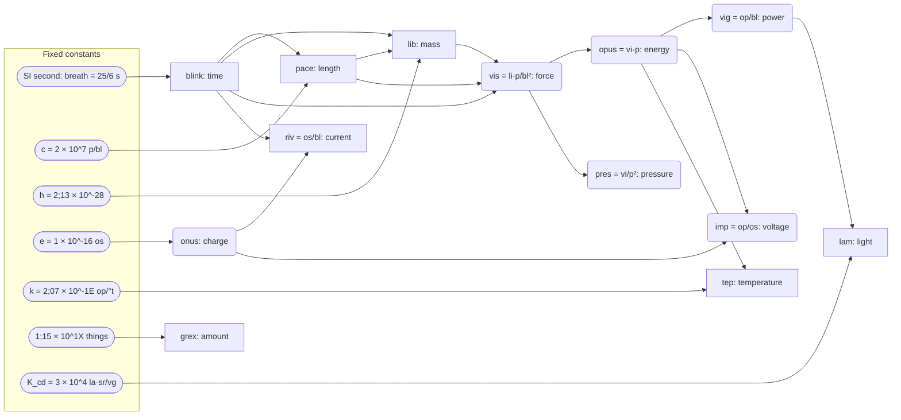

## Summary

### Base units and defining constants

| Quantity    | Unit  | Size (SI)              | Defined by (exact)                            | Named after |
|-------------|-------|------------------------|-----------------------------------------------|---|
| Time        | blink | 0.347222 s (25/72 s)   | 1 breath (10 blinks) = 25/6 SI seconds | English: the blink of an eye |
| Length      | pace  | 1.452545 m             | c = 2 × 10^7 paces/blink                      | Latin passus, a pace |
| Mass        | lib   | 1.771431 kg            | h = 2;13 × 10^-28                             | Latin libra, pound / scales |
| Temperature | tep   | 0.694346 K             | k = 2;07 × 10^-1E, 0 °t = 289;485 ta (≈ freezing) | Latin tepor, warmth |
| Current     | riv   | 12.2847 A              | e = 1 × 10^-16 onus                           | Latin rivus, stream |
| Amount      | grex  | 6.17235 × 10^23 (dec) things | 1 grex = 1;15 × 10^1X things            | Latin grex, flock |
| Light       | lam   | 0.980246 cd            | K_cd = 3 × 10^4 lam·sr/vg at 19,042,90X,764,540 per blink | Latin lampas, lamp |

### Exact SI values

Every unit converts to SI exactly. The definitions use Paludal's fixed constants, which give short round
numbers; written as SI fractions most of them would be long:

| Unit | Defined by | Exact SI value | Decimal (dec) |
|---|---|---|---|
| blink | 1 breath = 25/6 s | 25/72 s | 0.347 222 222 s |
| pace | c = 2 × 10^7 p/bl | 3,747,405,725 / 2,579,890,176 m | 1.452 544 670 m |
| lib | h = 2;13 × 10^-28 | a fraction of 96 digits | 1.771 431 179 kg |
| tep | k = 2;07 × 10^-1E | a fraction of 36 digits | 0.694 345 838 K |
| 0 °t | 0 °t = 289;485 ta | 289;485 tep above absolute zero | 273.149 946 686 K |
| onus | e = 1 × 10^-16 | 1.602176634 × 10^-19 × 12^18 C (dec) | 4.265 528 250 C |
| riv | onus per blink | a fraction of 44 digits | 12.284 721 361 A |
| grex | 1;15 × 10^1X things | a fraction of 38 digits | 1.024 943 427 mol |

### Derived and everyday units

| Quantity          | Unit | Size (SI)        | Named after |
|-------------------|------|------------------|---|
| Beat              | beat | 1.04167 s (3 blinks, 25/24 s) | English: a heartbeat |
| Clock unit        | breath | 4.16667 s (10 blinks = 4 beats) | English: one breath |
| Dozenal hour      | chime | 2 hours exactly (1,000 breaths, 0;1 day) | English: clocks chime on the hour |
| Dozenal minute    | moment | 50 s exactly (0;01 chime, 10 breaths) | English moment, from Latin momentum |
| 1/10 pace         | unc  | 12.1 cm          | Latin uncia, a twelfth |
| 1/100 pace        | dig  | 1.01 cm          | Latin digitus, finger |
| 0;2 pace          | span | 24.2 cm          | English span, a hand's spread |
| 0;4 pace          | ulna | 48.4 cm          | Latin ulna, forearm |
| 0;6 pace          | gress | 72.6 cm         | Latin gressus, a step |
| 1,000 paces        | iter | 2.51 km          | Latin iter, road, journey |
| 930 paces (sea, air) | navis | 1.935 km      | Latin navis, ship |
| Area (1,000 p²)   | ager | 3,646 m²         | Latin ager, field |
| Volume (unc³)     | cub  | 1.7736 L         | Latin cubus, cube |
| Force             | vis  | ≈ 21.3 N         | Latin vis, force |
| Energy            | opus | ≈ 31.0 J         | Latin opus, work |
| Power             | vig  | ≈ 89.3 W         | Latin vigor, liveliness |
| Pressure          | pres | ≈ 10.1 Pa        | Latin pressus, pressed |
| Charge            | onus | ≈ 4.266 C        | Latin onus, load |
| Voltage           | imp  | ≈ 7.268 V        | Latin impetus, push |

### How the units connect

Each fixed constant defines one base unit; the derived units are built from the base units.

### Rules of thumb

- A cub of water weighs a lib (0.9994 at 20 °C). A dig-cube of water ≈ 1/1,000 lib ≈ 1 g.
- Time of day = three digits of moments since midnight, like 24-hour time: 000 midnight, 300 dawn, 600 noon, 900 dusk.
- A moment (50 s) is about a minute; a beat (1.04 s) is about a second.
- 100 km/h ≈ 68 paces/breath; motorway limit 70 (105 km/h).
- Water freezes at 0 tep, boils at ≈ 100 tep. Body ≈ 45;3 tep.
- 240 V mains ≈ 29 imp, 230 V ≈ 27;8, 120 V ≈ 14;6, a 12 V car ≈ 1;8. A kettle draws ≈ 0;X riv.
- A 6 ft person ≈ 1¼ paces. 1 inch ≈ 2;6 digs.
