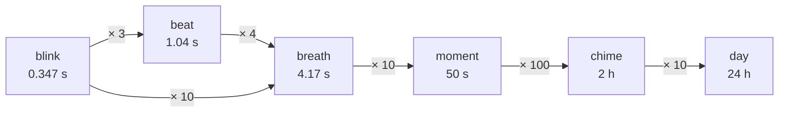

## Time

**Decided:** base unit **the blink** = 1/10 breath ≈ 0.34722 seconds (1/100,000 of a day)

**Decided:** **beat** = 3 blinks = 0;3 breath = 25/24 s ≈ 1.04 s - the nearest thing to a second.
Clock unit: the **breath** = 10 blinks = 4 beats = 1/10,000 of a day (1/20,736 dec) ≈ 4.16667 seconds.

**Why:** the time units are named after the body's own rhythms - a blink of the eye, a heartbeat, a breath -
which suits a human-focused system and makes a memorable set (blink, beat, breath). The sizes fit: a blink
lasts ~0.1-0.4 s, a resting heart beats ~once a second, and a resting breath (or one "in for 4" count in
meditation) is ~4 s. The beat was added because people need a second-sized unit (counting, timing, music).
Rejected: tick for 0.35 s (a clock tick is ~1 s); tick / tock (clock words don't pair with breath); pulse.
The old 4.17 s "tick" is now the breath. Clocks can still "tick" each beat informally. Removed: the wink (half a blink, 0.17 s) - too fast to be
useful at human scale.

**Advantage:** time units are easy to remember and to feel: beats and breaths can be counted without a clock.

**Why:** with the breath as base, derived units are tiny (force 0.148 N, power 0.052 W).
With the blink: force ≈ 21.3 N, energy ≈ 31 J, power ≈ 89 W, pressure ≈ 10.1 Pa - human-sized.

**Advantage:** force, energy, power and pressure come out at everyday sizes (vis ≈ 21 N, vig ≈ 89 W), usable without prefixes.

Steps are dozenal (× 10 = ×12 dec, × 100 = ×144 dec):

- Blink is the base for physics. On the clock the chime, moment and breath read like hours, minutes and
  seconds; the beat is the second-sized unit for counting and timing.
- Human scale: reaction time ≈ 3/4 blink, heartbeat 2-3 blinks, 100 m sprint ≈ 28 (dec) blinks

The day divides by twelve at every step, and each step is one digit of the time:

| Part of a day | Unit           | Size              | Digit of the time (E91;74) | Hand   |
|---------------|----------------|-------------------|----------------------------|--------|
| 1             | day            | 24 hours          |                            |        |
| 0;1           | chime          | 2 hours           | E                          | hand 1 |
| 0;01          | (not yet named) | 10 minutes       | 9                          | hand 2 |
| 0;001         | moment         | 50 seconds        | 1                          | hand 3 |
| 0;0001        | breath         | 4.1667 seconds    | 7                          | hand 4 |
| 0;00001       | blink          | 0.3472 seconds    | 4                          |        |

- The beat (0;3 breath, 1.0417 s) sits between the breath and the blink: 4 beats to a breath, 3 blinks to a beat

**Decided:** the **chime** = 0;1 day = 1,000 breaths = 2 hours exactly, the dozenal hour (clocks chime on the
hour). Rejected: bell (sounds like the bel, B; ship's bells are half-hours), hora, mark.

**Why:** people use hours constantly, so the dozenal system needs an hour-sized unit; 0;1 day is the 2-hour mark on the twelve-mark dial. "Chime" is what clocks do on the hour.

**Advantage:** an hour-sized unit that is also a clean step of the day: one chime is one mark on the dial.

**Decided:** the **moment** (symbol **mt**) = 0;01 chime = 10 breaths = 50 s exactly - the dozenal minute.

**Why:** time of day works like hours, minutes and seconds: three named parts. The chime is the hour, the
moment the minute (two digits, read from hands 2 and 3), the breath the second. The
10-minute digit (0;1 chime) has no name yet (see Open items). "Wait a moment" already means about
a minute, and the medieval moment was a unit of time (90 s).

**Advantage:** the clock reads like hours, minutes and seconds, with a word people already use for about a minute.

**Decided:** time of day is written as **moments since midnight, always three digits**, with breaths after
the dozenal point: **E91** (about 23:30), or **E91;7** to the breath. Leading zeros are required: midnight is
000, and 051 is about 00:51.

**Why:** adopt prior art: Paul Rapoport's dozenal clocks (clocks.dozenal.ca) already read this way (E51.E4),
with a dot where Paludal uses the semicolon. Everyday times then need no punctuation, like the 24-hour "2330"
on timetables, and three digits is the easy group size. A time is a count of a named unit, the moment, and
each digit is one hand on the clock: hands 1 to 3 before the point, hand 4 after it. The first digit is
still the chime. Leading zeros, as in 24-hour "0051", keep every time three digits long, so the first digit
is always the chime and times line up in tables. Replaces the earlier chime;moments form (E;91), which put the
point after the first digit.

**Advantage:** times are three digits with no punctuation, read straight off the clock's hands, and match
existing dozenal clocks.

| Time   | Chime | Moments | Breath | Reads                          |
|--------|-------|---------|--------|--------------------------------|
| E91;7  | E     | 91      | 7      | el chimes, 91 moments, 7 breaths |
| 600    | 6     | 00      |        | noon                           |
| 051    | 0     | 51      |        | about 00:51                    |

- 000 = midnight, 600 = noon
- the number is in moments: the time 93X is the fraction 0;93X day, and the same three digits are the angle
  of hand 1 and the compass bearing in thousandths of a turn (see Angle)
- durations are in moments too: 90 mt is an hour and a half (0;9 ch), and 130 mt is two and a half hours (1;3 ch)

**Decided:** times more precise than a breath just add digits after it: EX0;53 (3 blinks past EX0;5). On
screens, the extra digits are shown smaller or dimmer, like the hundredths on a stopwatch.

**Why:** a time of day is a single number - moments since midnight - so times can be subtracted and compared
directly (EX0;5 - 930 = 270;5 moments ≈ 5 h 10 min). A second semicolon (EX0;5;3) would break that, and a space
(EX0;5 3) makes the digits look unrelated. Decimal times do the same: 9.58 s, 1:23.45 on a stopwatch.

**Advantage:** any two times can be subtracted or compared as ordinary numbers, at any precision.

- spoken like "nine forty-five": E91 = "el, nine-one"; 600 = "six"; 051 = "zero, five-one"; with breaths,
  "el, nine-one, seven"

### Definition of time

**Decided:** **1 breath = 25/6 SI seconds exactly** (1 blink = 25/72 s). Today that is 7,50E,583,273 caesium
periods (38,302,632,375 dec), since SI fixes the caesium frequency.

**Why:** time is the one unit that has to fit the Earth, and SI already keeps the second for the whole world.
Defining the breath by the SI second rather than by the caesium count means the two can never split: when SI
redefines the second with optical clocks (planned for 2030 CE), caesium becomes a measured value, and a
caesium-count definition would be off from SI by up to about 1 part in 10^16 (dec), the uncertainty of the
measured caesium value. Replaces the earlier
definition by the caesium count (which Primel also uses). Every other base unit stays defined by a fixed
constant (c, h, k, e, the grex count), because those are fixed in SI too, so they can't drift either, and their
values are short round dozenal numbers where the same units written as SI fractions would be up to 96 digits
long (see Exact SI values).

**Advantage:** Paludal time never drifts from UTC or SI, needs no leap breaths of its own, converts to SI
exactly, and gets every future improvement to the second for free.

- So 1 blink = 750,E58,327;3 caesium periods today (terminates in dozenal; 3,191,886,031.25 dec)
- The day stays at exactly 86,400 SI seconds.
- Converting between SI and dozenal time is exact (no drift, no leap breaths beyond what SI already needs).
- Leap breaths: none of our own. The breath follows UTC, and leap seconds are being phased out. None has
  been added since 2016 CE, and the CGPM decided in 2022 CE that by 2035 CE the gap allowed between UTC and
  the Earth's rotation (UT1) will be widened, so that leap seconds stop for at least a century. The new limit,
  and what happens when it's reached (a larger step, or none at all), are still to be decided
- Paludal won't be in use before 2035 CE, so a Paludal clock never has to show a leap second (one second is
  an awkward 2;X69 blinks). Whatever UTC does after that, Paludal time does too
- Survives the planned SI redefinition of the second (optical clocks, ~2030 CE): the breath simply follows the SI second.
  SI fixes the caesium-133 frequency at exactly 9,192,631,770 Hz (since 1967 CE); that count, like ours, was
  chosen to fit the Earth (the 1900 CE year). The planned replacement will probably be a weighted mix of
  several optical clock transitions rather than one atom, about 100 times more precise. Because the breath is
  exactly 25/6 SI seconds, Paludal gets whatever SI chooses at no cost
- **A universal approximation:** 1 blink ≈ **8 × 10^11 periods of the hydrogen 1S-2S transition** (0.038%
  dec out). Hydrogen is the simplest atom and the most common element, and its frequencies can in
  principle be calculated from fundamental constants, so it's the natural way to explain the blink to someone
  with no Earth reference (the Pioneer plaque used hydrogen for the same reason)
- Not used as the definition: the 1S-2S frequency is measured to 4.5 × 10^-15 (dec), about 45 times less
  precisely than caesium fountain clocks, and the two best measurements differ by 17 Hz; defining time by it
  would lose the exact SI conversion. A round count (8 × 10^11) would also put clocks 33 s a day off the day
- Not based on the day itself (Earth's rotation is irregular) - must be as good as SI.
- Rejected:
  - 7,500,000,000 (fully round): day 77 s too short, drifts ~8 h/year.
  - 7,50E,580,000: drifts ~4.6 s (~1.1 breaths)/year, needs a leap breath nearly every year.
  - 7,50E,583,000: drifts ~0.31 s/year - acceptable, but no real benefit over exact.
  - 7,50E,583,270: would make the blink a whole number of periods (750,E58,327), but the breath would no
    longer be exactly 25/6 s, so Paludal clocks would drift ~2.5 ms/year from UTC (1 s in ~400 years)
    and every time conversion would need a long factor.
