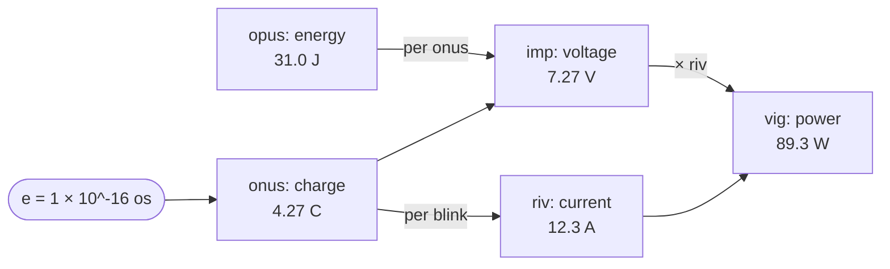

## Electricity

**Decided:** fix the elementary charge **e = 1 × 10^-16 onus** exactly (12^-18 dec).

**Why:** a round fixed constant, exactly like SI. imp × riv is always a vig (89.3 W), so e only decides how
that is split between voltage and current. This split puts the imp at 7.27 V and the riv at 12.3 A, where
the everyday numbers fall best: the voltages printed on batteries, chargers, cars and sockets need no
prefix (car 1;8 im, mains 28 or 29 im), and household currents are about a riv (a kettle 0;X riv, a
16 A circuit 1;4 riv). Replaces
the earlier e = 1 × 10^-15 (riv 1.02 A, imp 87.2 V), which made currents neat but left every everyday
voltage needing a prefix (AA 2;6 bcim, car 1;8 ucim).

**Advantage:** the numbers people actually read - voltages on labels and sockets, currents on chargers and circuits - mostly need no prefix.

- 1 onus (charge) ≈ 4.266 C
- 1 riv (current, onus/blink) ≈ 12.285 A - about what a socket circuit carries (10-16 A)
- 1 imp (voltage, opus/onus) ≈ 7.268 V
- Common voltages aren't round (set by chemistry and history), but they're all plain imps. Small ones use
  the uncia-imp (ucim, 0;1 imp ≈ 0.606 V), and small currents the tricia-riv (tcri ≈ 7.1 mA):

| Voltage          | imp    | uncia-imp |
|------------------|--------|-----------|
| 1.5 V (AA)       | 0;258  | 2;58      |
| 5 V (USB)        | 0;830  | 8;30      |
| 12 V (car)       | 1;799  | 17;99     |
| 24 V             | 3;376  | 33;76     |
| 120 V mains      | 14;62  |           |
| 230 V mains      | 27;79  |           |
| 240 V mains      | 29;03  |           |

| Current                    | riv   |
|----------------------------|-------|
| 20 mA (LED)                | 0;003 (2;9X tcri) |
| 2 A (phone charger)        | 0;1E5 |
| 10 A (AU socket, kettle)   | 0;992 (≈ 0;X) |
| 16 A (EU socket circuit)   | 1;376 |
| 20 A (US circuit)          | 1;765 |
| 32 A (oven, EV charger)    | 2;731 |

- Rejected: e = 1 × 10^-15 (riv 1.02 A, imp 87.2 V: every everyday voltage needs a prefix);
  1 × 10^-17 (imp 0.61 V, riv 147 A: voltages are whole numbers, but a phone charger is 0;017 riv);
  0;2 × 10^-15 (imp 14.5 V, riv 6.1 A: a car battery is about 1 imp, but mains and sockets come out no better).
- No choice makes both close to SI: imp × riv = vig (89.3 W), fixed by the mechanical units, where
  volt × amp = 1 W. The split can only trade one for the other.
