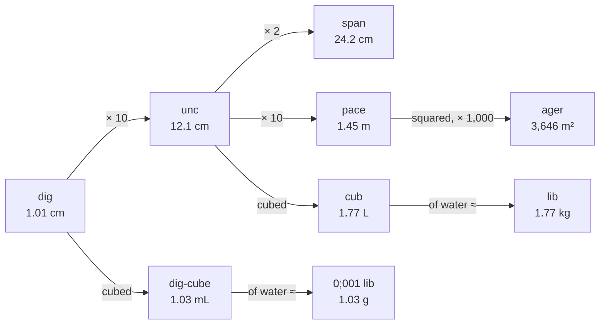

## Volume

**Decided:** the **cub** = a cube 1 unc per side ≈ 1.7736 L. Water in it ≈ 1 lib.

**Why:** volume follows directly from length (no separate definition), it makes the water rule of thumb
work, and dozenal fractions of it land close to common drink sizes.

**Advantage:** volume needs no definition of its own, a cub of water weighs about a lib, and drink sizes stay familiar.

How length leads to area, volume and (through water) mass:

Good size for milk. Dozenal fractions land close to common drink and pub sizes (all ~4% larger):

| Fraction   | mL   | Close to                                                |
|------------|------|---------------------------------------------------------|
| 1          | 1,774 | large milk                                              |
| 0;8 (2/3)  | 1,182 | pub jug (AU 1,140)                                       |
| 0;6 (1/2)  | 887  |                                                         |
| 0;4 (1/3)  | 591  | pint (AU 570, UK 568); US 20 fl oz bottle (591) - almost exact |
| 0;3 (1/4)  | 443  | schooner (AU 425); 440 mL can                           |
| 0;2 (1/6)  | 296  | pot/middy (AU 285), UK half pint (284); 300 mL bottle   |
| 0;1 (a twelfth) | 148  | small glass / wine pour (150)                           |

Small volumes (kitchen and drinks):

| Fraction | mL   | Close to                                                            |
|----------|------|---------------------------------------------------------------------|
| 0;06     | 73.9 | quarter cup                                                         |
| 0;1      | 148  | half cup                                                            |
| 0;2      | 296  | cup (AU 250, US 237) - a bit larger                                 |
| 0;025    | 29.8 | spirit shot (30 mL)                                                 |
| 0;01     | 12.3 | standard drink of pure alcohol: 9.7 g ethanol (AU std drink = 10 g) |
| 0;004    | 4.1  | teaspoon (5 mL)                                                     |
| 0;001    | 1.03 | a dig-cube, about 1 mL / 1 g of water                               |

### Rainfall

**Proposed (not decided):** rainfall is measured as a depth in **lin** (0;1 dig ≈ 0.84 mm; the name is
also still proposed), and that's the same number as libs of water per square pace.

- A cub is 0;001 cubic pace, so 1 cub spread over 1 square pace is 0;001 p = 1 lin deep, and a cub of water
  weighs about a lib. So **1 lin of rain = 1 li of water per p²** - just as 1 mm of rain is 1 L (1 kg) per m²
- Gauges keep measuring depth, as they do now; the lib figure is for tanks, roofs and gardens:
  10 lin of rain on a 100 p² roof (304 m²) is 1,000 li, which fills 1,000 cu (1 tqcu, 3.06 m³) of tank

| Rain | mm (dec) | lin |
|---|---|---|
| Light shower | 1 | 1;2 |
| Rainy day | 10 | E;X |
| Heavy storm | 25 | 25;8 |
| Flood rain | 100 | 9X;E |
| Sydney, a year | 1,200 | 9XE |
